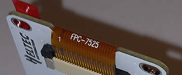

# Heltec E-Ink Modules - Flex-Connector Labels

The E-ink modules have an orange "flex-connector", attaching the display to the PCB.
There is usually some amount of text printed on the connector.

This label is important for [identifying the model of your display](/docs/README.md#supported-displays---identify-your-model).