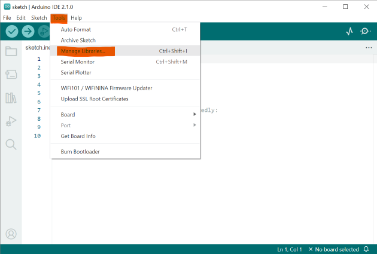
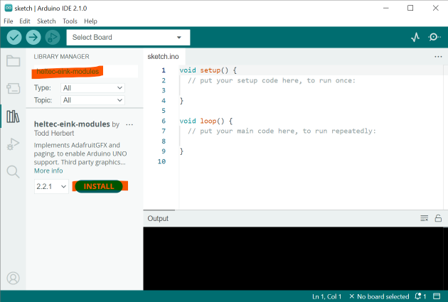
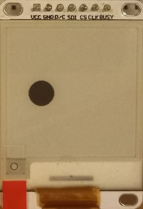

# Heltec E-Ink Modules - Quickstart
## 1. Add the library to Arduino IDE

*Tools* > Manage Libraries... | Search for &nbsp;`heltec-eink-modules`,  install
----|----
 | 

## 2. Using a *level shifter*, connect your display
*Arduino UNO* uses 5V signals, *Heltec E-ink displays* use 3.3V signals. Without a level shifting circuit, you will damage your display.

### Example of connection, using level shifter:

     4 x 1kΩ Resistor
     4 x 2kΩ Resistor

Schematic|Realization
---|---
 | 

## 3. Open the `bare_minimum` example sketch

## 4. Identify your display's model

Compare your display against the table in [README.md](/docs/README.md#identifying-your-display)

## 5. Configure the sketch for your display

Specify pins to which pins you have connected your display. *If you have connected your display as shown above, these pins are already correct.*

Uncomment the line (delete the `//`) for your display model.   

## 6. Upload the sketch to your Arduino

All going well, your display should flash, and the black circle from the example code should appear.

If, initially, your display does not respond, you may need to cycle power, by disconnecting and reconnecting your Arduino's USB cable.