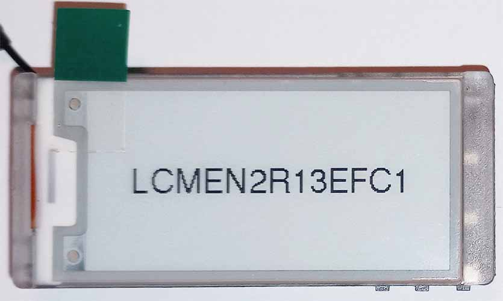
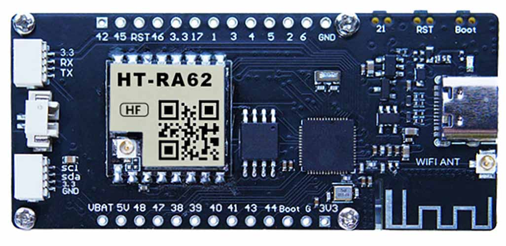
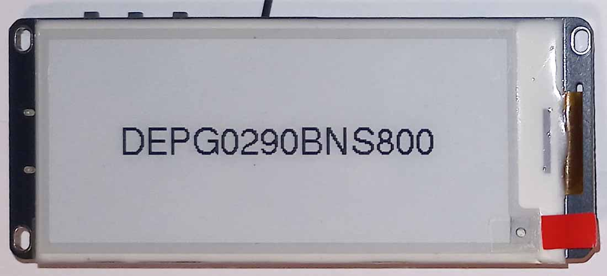
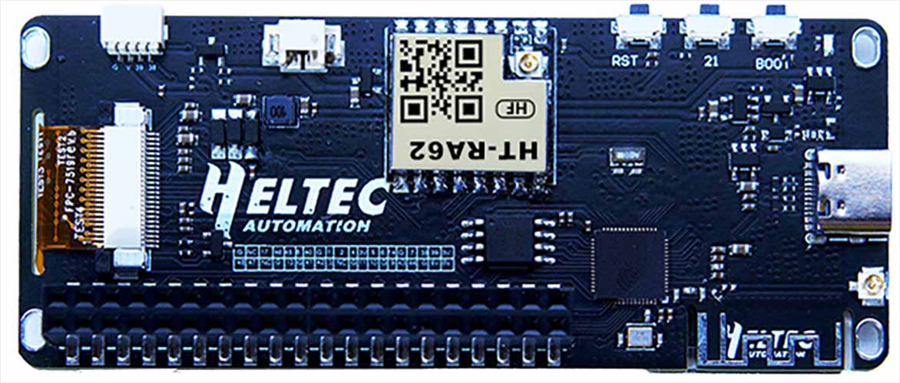
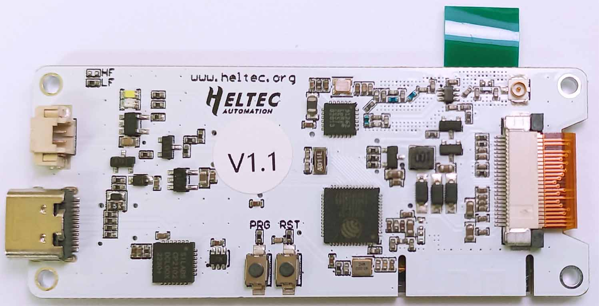

# Heltec E-Ink Modules

Third-party Arduino Library for **Heltec E-Ink Displays**.<br />
Run-time drawing, using Adafruit-GFX.

**[Read the API](/docs/API.md)** <br />

- [Vision Master](#vision-master)
- [Wireless Paper](#wireless-paper)
- [SPI Displays](#spi-displays)
  - [Identification](#identification)
  - [Wiring](#wiring)
  - [Should I use `update()` or `DRAW()`?](#should-i-use-update-or-draw)
- [Drawing](#drawing)
  - [Shapes and Text](#shapes-and-text)
  - [Fonts](#fonts)
  - [Images](#images)
  - [SD card](#sd-card)
  - [Fast Mode (Partial Refresh)](#fast-mode-partial-refresh)
- [Troubleshooting](#troubleshooting)
- [Installation](#installation)
  - [Arduino](#arduino)
  - [PlatformIO](#platformio)
- [Acknowledgements](#acknowledgements)

## Vision Master

See [Getting Started with Vision Master](/docs/VisionMaster/vision_master.md#getting-started) for instructions on setting up Arduino IDE or PlatformIO.<br />
<small>(Important platformio.ini config)</small>

<table>
    <thead>
        <tr>
            <th>Model</th>
            <th>Driver Class</th>
            <th align="center">Front Image</th>
            <th align="center">Rear Image</th>
            <th>Resolution (px)</th>
        </tr>
    </thead>
    <tbody>
        <tr>
            <td><strong>E213</strong></td>
            <td><code>EInkDisplay_VisionMasterE213</code></td>
            <td align="center"></td>
            <td align="center">
            </td>            
            <td>250 x 122</td>
        </tr>
        <tr>
            <td><strong>E290</strong></td>
            <td><code>EInkDisplay_VisionMasterE290</code></td>
            <td align="center"></td>
            <td align="center"></td>
            <td>296 x 128</td>
        </tr>
    </tbody>
</table>

```cpp
#include "heltec-eink-modules.h"

EInkDisplay_VisionMasterE213 display;

void setup() {
    display.print("Hello, World!");
    display.update();
}

void loop() {}
```

## Wireless Paper

See [Getting Started with Wireless Paper](/docs/WirelessPaper/wireless_paper.md) for instructions on setting up Arduino IDE or PlatformIO.<br />
<small>(Important platformio.ini config)</small>

<table>
    <thead>
        <tr>
            <th>Hardware Version</th>
            <th>Driver Class</th>
            <th><a href="FlexConnector/flex_labels.md">Flex Connector Label</a></th>
            <th align="center">Front Image</th>
            <th align="center">Rear Image</th>
        </tr>
    </thead>
    <tbody>
        <tr>
            <td><strong>V1.1</strong></td>
            <td><code>EInkDisplay_WirelessPaperV1_1</code></td>
            <td>(not visible)</td>
            <td align="center"></td>
            <td align="center">
            </td>            
        </tr>
        <tr>
            <td><nobr><strong>Original</strong> (V1.0)</nobr></td>
            <td><code>EInkDisplay_WirelessPaperV1</code></td>
            <td>FPC-7528B</td>
            <td align="center"></td>
            <td align="center"></td>
        </tr>
    </tbody>
</table>


```cpp
#include "heltec-eink-modules.h"

EInkDisplay_WirelessPaperV1_1 display;

void setup() {
    display.print("Hello, World!");
    display.update();
}

void loop() {}
```

A [low power state](/docs/WirelessPaper/wireless_paper.md#deep-sleep) is available for the whole board (18μA while sleeping).

## SPI Displays

### Identification

Pay attention to the model name: you will need it to use the library.

#### 1.54 Inch

<table>
    <thead>
        <tr>
            <th>Model Name</th>
            <th><a href="FlexConnector/flex_labels.md">Flex Connector Label</a></th>
            <th align="center">Front Image</th>
            <th align="center">Rear Image</th>
            <th>Colors</th>
            <th>Screen Protector</th>
            <th>Resolution (px)</th>
            <th><a href="#fast-mode-partial-refresh">Fastmode (partial&nbsp;refresh)</a></th>
        </tr>
    </thead>
    <tbody>
        <tr>
            <td><strong>DEPG0154BNS800</strong></td>
            <td>FPC-7525</td>
            <td align="center"></td>
            <td align="center"></td>            
            <td>Black, White</td>
            <td>Red Tab</td>
            <td>152 x 152</td>
            <td>Yes</td>
        </tr>
        <tr>
            <td><strong>DEPG0150BNS810</strong></td>
            <td>FPC-8101</td>
            <td align="center"></td>
            <td align="center"></td>
            <td>Black, White</td>
            <td>Red Tab</td>
            <td>200 x 200</td>
            <td>Yes</td>
        </tr>
        <tr>
            <td><strong>GDEP015OC1</strong>&nbsp;<sup>?</sup></td>
            <td>HINK-E0154A05-A2</td>
            <td align="center"></td>
            <td align="center"></td>            
            <td>Black, White</td>
            <td>Blue Tab</td>
            <td>200 x 200</td>
            <td>Yes</td>
        </tr>
    </tbody>
</table>


#### 2.13 Inch

<table>
    <thead>
        <tr>
            <th>Model Name</th>
            <th><a href="FlexConnector/flex_labels.md">Flex Connector Label</a></th>
            <th align="center">Front Image</th>
            <th align="center">Rear Image</th>
            <th>Colors</th>
            <th>Screen Protector</th>
            <th>Resolution (px)</th>
            <th><a href="#fast-mode-partial-refresh">Fastmode (partial&nbsp;refresh)</a></th>
        </tr>            
    </thead>
    <tbody>
        <tr>
            <td><strong>DEPG0213RWS800</strong></td>
            <td>FPC-7528B</td>
            <td align="center"></td>
            <td align="center"></td>            
            <td>Black, White, Red</td>
            <td>Red Tab</td>
            <td>250 x 122</td>
            <td>No</td>
        </tr>        
        <tr>
            <td><strong>QYEG0213RWS800</strong></td>
            <td>FPC-7528</td>
            <td align="center"></td>
            <td align="center"></td>            
            <td>Black, White, Red</td>
            <td>Red Tab</td>
            <td>250 x 122</td>
            <td>No</td>
        </tr>
    </tbody>
</table>

#### 2.9 Inch

<table>
    <thead>
        <tr>
            <th>Model Name</th>
            <th><a href="FlexConnector/flex_labels.md">Flex Connector Label</a></th>
            <th align="center">Front Image</th>
            <th align="center">Rear Image</th>
            <th>Colors</th>
            <th>Screen Protector</th>
            <th>Resolution (px)</th>
            <th><a href="#fast-mode-partial-refresh">Fastmode (partial&nbsp;refresh)</a></th>
        </tr>            
    </thead>
    <tbody>
        <tr>
            <td><strong>DEPG0290BNS800</strong></td>
            <td>FPC-7519 rev.b</td>
            <td align="center"></td>
            <td align="center"></td>            
            <td>Black, White</td>
            <td>Red Tab</td>
            <td>296 x 128</td>
            <td>Yes</td>
        </tr>
        <tr>
            <td><strong>DEPG0290BNS75A</strong>&nbsp;</td>
            <td>FPC-750</td>
            <td align="center"></td>
            <td align="center"></td>            
            <td>Black, White</td>
            <td>Red Tab</td>
            <td>296 x 128</td>
            <td>Yes</td>
        </tr>
        <tr>
            <td><strong>GDE029A1</strong></td>
            <td>SYX-1553</td>
            <td align="center"></td>
            <td align="center"></td>
            <td>Black, White</td>
            <td>Blue Tab</td>
            <td>296 x 128</td>
            <td>Yes</td>
        </tr>
    </tbody>
</table>

___

### Wiring

**Warning: in some cases, connecting directly to the display will cause damage!** <br />
See your boards's wiring page for specific information:

* [**Wiring:** Arduino Uno R3 / Arduino Nano](/docs/Wiring/wiring_m328p.md)
* [**Wiring:** Arduino Mega 2560](/docs/Wiring/wiring_m2560.md)
* [**Wiring:** ESP32](/docs/Wiring/wiring_esp32.md)
* [**Wiring:** ESP8266](/docs/Wiring/wiring_esp8266.md)
* [**Wiring:** SAMD21G18A](/docs/Wiring/wiring_samd21g18a.md)

```c++
// Specify your wiring when declaring the display
DEPG0150BNS810 display(dc, cs, busy);

// Optional: specify SDI and CLK (ESP32 & SAMD21* only)
DEPG0150BNS810 display(dc, cs, busy, sdi, clk)
```

<sub>[See here](/docs/Wiring/wiring_samd21g18a.md#optional-changing-mosi-and-sck-pins) for limitations of SAMD21G18A wiring</sub>

___
### Should I use `update()` or `DRAW()`?

The `DRAW()` operation allows for RAM saving tricks (paging). Required for older boards, configurable for new boards.
[More info about `DRAW()` here](/docs/Paging/paging.md).

```cpp
/* 
  Use DRAW() if:
   - you need to support Arduino Uno R3 / Mega 2560, or
   - you desperately need to save RAM
*/
    DRAW(display) {
        display.print("Hello, ");
        display.print("World!");
    }


// Otherwise, you're free to use update() instead
    display.clearMemory();
    display.print("Hello, ");
    display.print("World!");
    display.update();
```

## Drawing

### Shapes and Text

Drawing operations come from the **Adafruit GFX** library
You'll find a full list of supported commands in **[the API](/docs/API.md)**. Check out the [examples folder](/examples/) to see them in action.
Alternatively, [the official adafruit-gfx tutorial](https://learn.adafruit.com/adafruit-gfx-graphics-library/graphics-primitives) is a good place to start.

### Fonts
The library comes with a selection of custom fonts. You can create more with [truetype2gfx](https://rop.nl/truetype2gfx/).<br />
See the [Fonts example](/examples/fonts/fonts.ino).

### Images

As decided by the Adafruit library, the ancient *"XBitmap"* is the format of choice for pre-rendered graphics. Luckily, GIMP maintains good support for it. If you need a hint on how to use it, I have thrown together a [tutorial on preparing XBitmap images](XBitmapTutorial/README.md).

### SD card

It is possible to load and save .bmp images, using a cheap SD card SPI adapter. [Read more](/docs/SD/sd.md)

### Fast Mode (Partial Refresh)

E-Ink displays generally take several seconds to refresh. Some displays have an alternative mode, where the image updates much faster.

The trade-off is that images drawn in fast mode are of a lower quality. The process may also be particularly difficult on the hardware. **Use sparingly.**

*Not all displays support fast mode.*

Call [`fastmodeOn()`](/docs/API.md#fastmodeon) to enable.<br />
Call [`fastmodeOff()`](/docs/API.md#fastmodeoff) to return to normal.

<sub>\* Technically, this mode is not a true "partial refresh", as the whole display image is updated.</sub> 

## Troubleshooting

* **Double-check your wiring**<br />
    On breadboard, or header pins, it is easy to be one row out.<br />
    Make sure to use a level-shifter, if needed.

* **Double-check your constructor**<br />
    ```c++
    // Make sure to use the correct class for your display model
    EInkDisplay_WirelessPaperV1_1 display;

    // SPI displays: make sure your pins are set correctly
    DEPG0150BNS810 display(dc, cs, busy);   
    ```

* **Take a look at the [examples](/examples/), and the [API](/docs/API.md)**<br />
    Some commands might not work the way you would expect. If unsure, double check.

* **Disconnect and Reconnect**<br />
    If the display has been used incorrectly, it can get "stuck".<br />
    Remove all power from the display and Arduino for 5 seconds.

* **Make sure your build environment is configured correctly**<br />
    * [Vision Master](/docs/VisionMaster/vision_master.md#getting-started)
    * [Wireless Paper](/docs/WirelessPaper/wireless_paper.md#getting-started)
## Installation

### Arduino
Library can be installed to Arduino IDE with *Sketch* -> *Include Library* -> *Add .Zip Library..*, or through the built-in Library Manager. 

* [Setting up Arduino IDE for Vision Master boards](/docs/VisionMaster/vision_master.md#arduino-ide)
* [Setting up Arduino IDE for Wireless Paper boards](/docs/WirelessPaper/wireless_paper.md#arduino-ide)

### PlatformIO
Available through the built-in library registry, or alternatively, can be installed by extracting the Zip file to the lib folder of your project.

For Vision Master and Wireless Paper boards, your platformio.ini file needs to be [correctly configured](/platformio.ini).

## Acknowledgements

* Display information referenced from both [official Heltec sources](https://github.com/HelTecAutomation/e-ink), and [GxEPD2](https://github.com/ZinggJM/GxEPD2).
* Drawing functions provided by [GFX Root](https://github.com/ZinggJM/GFX_Root), which itself is a stripped down version of [Adafruit GFX](https://github.com/adafruit/Adafruit-GFX-Library).
* A bundled version of [SdFat](https://github.com/greiman/SdFat) is used with some platforms.
* [TJpg_Decoder](https://github.com/Bodmer/TJpg_Decoder) is bundled with certain examples.