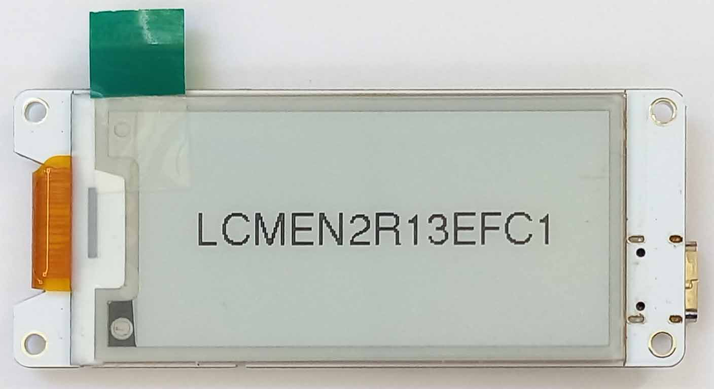
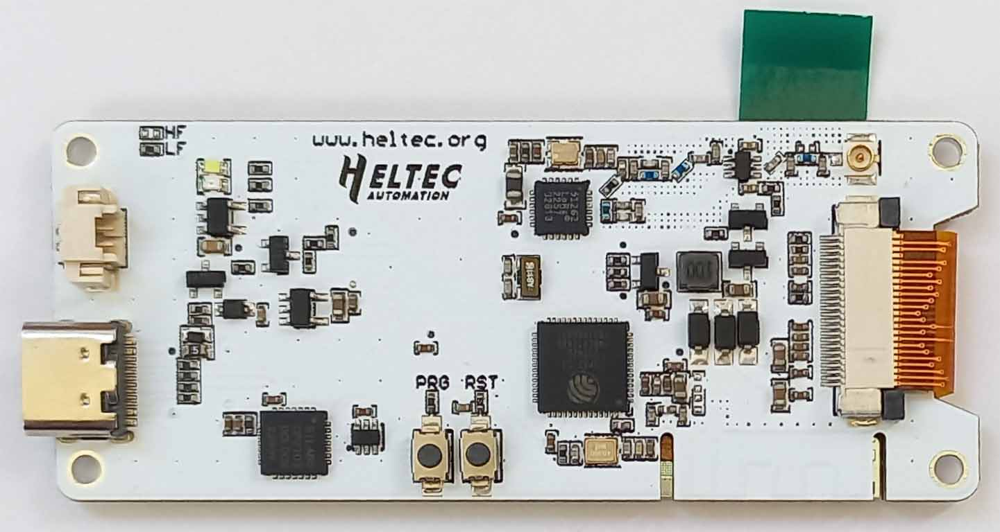
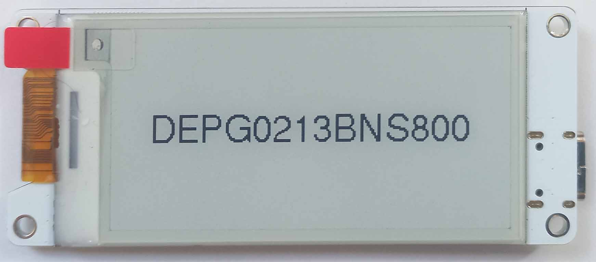
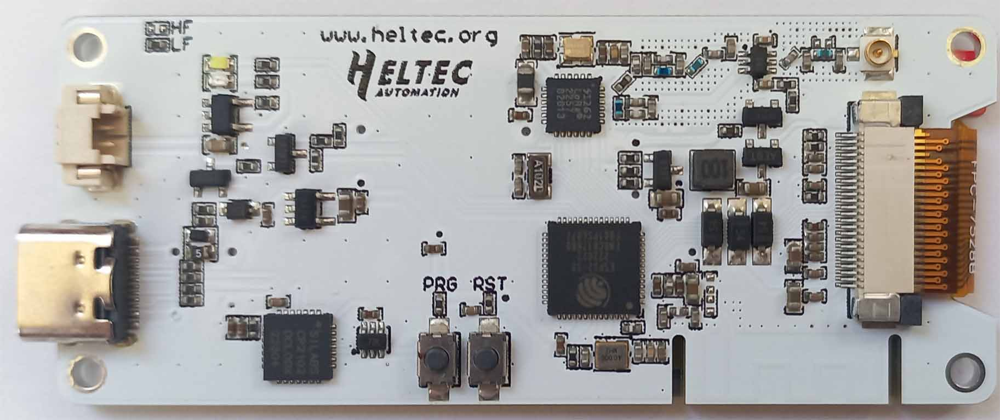

# Heltec E-Ink Modules

Third-party Arduino Library for **Heltec E-Ink Module** displays, and **Wireless Paper** boards<br />
Run-time drawing, using Adafruit-GFX.

**[Read the API](/docs/API.md)** <br />

**[Get started with "Wireless Paper" boards](/docs/WirelessPaper/wireless_paper.md)** <br />

- [Supported Platforms](#supported-platforms)
- [Supported Displays - **Identify your model**](#supported-displays---identify-your-model)
  - [1.54 Inch](#154-inch)
  - [2.13 Inch](#213-inch)
  - [2.9 Inch](#29-inch)
  - [Wireless Paper](#wireless-paper)
- [Wiring](#wiring)
- [Drawing](#drawing)
  - [Compatibility or Convenience?](#compatibility-or-convenience)
  - [Shapes and Text](#shapes-and-text)
  - [Fonts](#fonts)
  - [Images](#images)
  - [SD card](#sd-card)
  - [Shorter code](#shorter-code)
- [Configuration](#configuration)
  - [Model Name](#model-name)
  - [Pins](#pins)
  - [Saving RAM](#saving-ram)
  - [Saving Flash](#saving-flash)
  - [Saving Power](#saving-power)
  - [Fast Mode (Partial Refresh)](#fast-mode-partial-refresh)
- [Troubleshooting](#troubleshooting)
- [Installation](#installation)
- [Acknowledgements](#acknowledgements)


## Supported Platforms

Platform    | Tested                        
------------|-------------------------------
ATmega328P  | Arduino Uno R3, Arduino Nano
ATmega2560  | Arduino Mega 2560
ESP32       | Devkit V1, **Heltec Wireless Paper**
ESP8266     | NodeMcu v3, LOLIN D1 Mini
SAMD21G18A  | Protoneer Nano ARM

## Supported Displays - **Identify your model**

**Pay attention to the model name: you will need it to use the library.**

### 1.54 Inch

<table>
    <thead>
        <tr>
            <th>Model Name</th>
            <th><a href="FlexConnector/flex_labels.md">Flex Connector Label</a></th>
            <th align="center">Front Image</th>
            <th align="center">Rear Image</th>
            <th>Colors</th>
            <th>Screen Protector</th>
            <th>Resolution (px)</th>
            <th><a href="#fast-mode-partial-refresh">Fastmode (partial&nbsp;refresh)</a></th>
        </tr>
    </thead>
    <tbody>
        <tr>
            <td><strong>DEPG0154BNS800</strong></td>
            <td>FPC-7525</td>
            <td align="center"></td>
            <td align="center"></td>            
            <td>Black, White</td>
            <td>Red Tab</td>
            <td>152 x 152</td>
            <td>Yes</td>
        </tr>
        <tr>
            <td><strong>DEPG0150BNS810</strong></td>
            <td>FPC-8101</td>
            <td align="center"></td>
            <td align="center"></td>
            <td>Black, White</td>
            <td>Red Tab</td>
            <td>200 x 200</td>
            <td>Yes</td>
        </tr>
        <tr>
            <td><strong>GDEP015OC1</strong>&nbsp;<sup>1</sup></td>
            <td>HINK-E0154A05-A2</td>
            <td align="center"></td>
            <td align="center"></td>            
            <td>Black, White</td>
            <td>Blue Tab</td>
            <td>200 x 200</td>
            <td>Yes</td>
        </tr>
    </tbody>
</table>

<sup>1</sup> Closest match. No official information available. <br />


### 2.13 Inch

<table>
    <thead>
        <tr>
            <th>Model Name</th>
            <th><a href="FlexConnector/flex_labels.md">Flex Connector Label</a></th>
            <th align="center">Front Image</th>
            <th align="center">Rear Image</th>
            <th>Colors</th>
            <th>Screen Protector</th>
            <th>Resolution (px)</th>
            <th><a href="#fast-mode-partial-refresh">Fastmode (partial&nbsp;refresh)</a></th>
        </tr>            
    </thead>
    <tbody>
        <tr>
            <td><strong>DEPG0213RWS800</strong>&nbsp;<sup>2</sup></td>
            <td>FPC-7528B</td>
            <td align="center"></td>
            <td align="center"></td>            
            <td>Black, White, Red</td>
            <td>Red Tab</td>
            <td>250 x 122</td>
            <td>No</td>
        </tr>        
        <tr>
            <td><strong>QYEG0213RWS800</strong>&nbsp;<sup>2</sup></td>
            <td>FPC-7528</td>
            <td align="center"></td>
            <td align="center"></td>            
            <td>Black, White, Red</td>
            <td>Red Tab</td>
            <td>250 x 122</td>
            <td>No</td>
        </tr>
    </tbody>
</table>

<sup>2</sup> Currently, these two displays use the same driver. This is not guaranteed in the future. <br />

### 2.9 Inch

<table>
    <thead>
        <tr>
            <th>Model Name</th>
            <th><a href="FlexConnector/flex_labels.md">Flex Connector Label</a></th>
            <th align="center">Front Image</th>
            <th align="center">Rear Image</th>
            <th>Colors</th>
            <th>Screen Protector</th>
            <th>Resolution (px)</th>
            <th><a href="#fast-mode-partial-refresh">Fastmode (partial&nbsp;refresh)</a></th>
        </tr>            
    </thead>
    <tbody>
        <tr>
            <td><strong>DEPG0290BNS800</strong></td>
            <td>FPC-7519 rev.b</td>
            <td align="center"></td>
            <td align="center"></td>            
            <td>Black, White</td>
            <td>Red Tab</td>
            <td>296 x 128</td>
            <td>Yes</td>
        </tr>
        <tr>
            <td><strong>DEPG0290BNS75A</strong>&nbsp;</td>
            <td>FPC-750</td>
            <td align="center"></td>
            <td align="center"></td>            
            <td>Black, White</td>
            <td>Red Tab</td>
            <td>296 x 128</td>
            <td>Yes</td>
        </tr>
        <tr>
            <td><strong>GDE029A1</strong></td>
            <td>SYX-1553</td>
            <td align="center"></td>
            <td align="center"></td>
            <td>Black, White</td>
            <td>Blue Tab</td>
            <td>296 x 128</td>
            <td>Yes</td>
        </tr>
    </tbody>
</table>

### Wireless Paper

<table>
    <thead>
        <tr>
            <th>Model Name</th>
            <th><a href="FlexConnector/flex_labels.md">Flex Connector Label</a></th>
            <th align="center">Front Image</th>
            <th align="center">Rear Image&nbsp;<sup>3</sup></th>
            <th>Colors</th>
            <th>Screen Protector</th>
            <th>Resolution (px)</th>
            <th><a href="#fast-mode-partial-refresh">Fastmode (partial&nbsp;refresh)</a></th>
        </tr>
    </thead>
    <tbody>
        <tr>
            <td><strong>LCMEN2R13EFC1</strong></td>
            <td><b>Hidden, printed on back-side</b><br />(HINK-E0213A162-FPC-A0)</td>
            <td align="center"></td>
            <td align="center">
            <br />
            </td>            
            <td>Black, White</td>
            <td>Green Tab</td>
            <td>250 x 122</td>
            <td>Yes</td>
        </tr>
        <tr>
            <td><strong>DEPG0213BNS800</strong></td>
            <td>FPC-7528B</td>
            <td align="center"></td>
            <td align="center"></td>
            <td>Black, White</td>
            <td>Red Tab</td>
            <td>250 x 122</td>
            <td>Yes</td>
        </tr>
    </tbody>
</table>

<sup>3</sup> Version-marking sticker is present on *some* LCMEN2R13EFC1 boards.<br />

## Wiring

**Warning: in some cases, connecting directly to the display will cause damage!** <br />
See your boards's wiring page for specific information:

* [**Wiring:** Arduino Uno R3 / Arduino Nano](/docs/Wiring/wiring_m328p.md)
* [**Wiring:** Arduino Mega 2560](/docs/Wiring/wiring_m2560.md)
* [**Wiring:** ESP32](/docs/Wiring/wiring_esp32.md)
* [**Wiring:** ESP8266](/docs/Wiring/wiring_esp8266.md)
* [**Wiring:** SAMD21G18A](/docs/Wiring/wiring_samd21g18a.md)
* [Wireless Paper](/docs/WirelessPaper/wireless_paper.md)

## Drawing

### Compatibility or Convenience?

#### 1. Compatibility

The `DRAW()` operation allows for *RAM saving tricks* (paging). Required for older boards, configurable for new boards.<br />
[More info about paging here.](/docs/Paging/paging.md)

```c++
#include "heltec-eink-modules.h"

// Use the correct class for your display; set pins for D/C, CS, BUSY
DEPG0150BNS810 display(2, 4, 5);

void setup() {

    // Any config is set first
    display.setBackgroundColor(BLACK);

    // Drawing action goes inside DRAW()
    DRAW (display) {
        display.fillCircle(50, 100, 20, WHITE);
        display.fillCircle(50, 100, 10, BLACK);
    }

}

void loop() {}
```

#### 2. Convenience

If you're using a [fancy new device](/docs/Paging/paging.md), you can choose to avoid the `DRAW()` pattern:

```c++
#include "heltec-eink-modules.h"

// Use the correct class for your display; set pins for D/C, CS, BUSY
DEPG0150BNS810 display(2, 4, 5);

void setup() {
    
    display.setBackgroundColor(BLACK);

    // Start working on a new drawing (with a BLACK background)
    display.clearMemory();

    // Draw the same circles from the other example
    display.fillCircle(50, 100, 20, WHITE);
    display.fillCircle(50, 100, 10, BLACK);
    
    // Whenever you're ready, display your masterpiece
    display.update();

}

void loop() {}
```

### Shapes and Text

Drawing operations come from the **Adafruit GFX** library
You'll find a full list of supported commands in **[the API](/docs/API.md)**. Check out the [examples folder](/examples/) to see them in action.
Alternatively, [the official adafruit-gfx tutorial](https://learn.adafruit.com/adafruit-gfx-graphics-library/graphics-primitives) is a good place to start.

### Fonts
The library comes with a selection of custom fonts. You can create more with [truetype2gfx](https://rop.nl/truetype2gfx/).<br />
See the [Fonts example](/examples/fonts/fonts.ino).

### Images

As decided by the Adafruit library, the ancient *"XBitmap"* is the format of choice for pre-rendered graphics. Luckily, GIMP maintains good support for it. If you need a hint on how to use it, I have thrown together a [tutorial on preparing XBitmap images](XBitmapTutorial/README.md).

### SD card

It is possible to load and save .bmp images, using a cheap SD card SPI adapter. [Read more](/docs/SD/sd.md)

### Shorter code

One trick you may find useful: 
```cpp
FullBounds f = display.bounds.full;
WindowBounds w = display.bounds.window;
```

This way, you have a short way to get dimension info.

```cpp
// These two are the same
box_width = display.bounds.window.width();
box_width = w.width();

// See the difference
display.drawRect(w.left(), w.top(), w.width(), w.height(), BLACK);

display.drawRect(   display.bounds.window.left(),
                    display.bounds.window.top(),  
                    display.bounds.window.width(),
                    display.bounds.window.height(),
                    BLACK   );
```


## Configuration

### Model Name

The **Model Name** of your display is used to select the correct driver. [Find your model name.](#supported-displays---identify-your-model)

### Pins

```c++
// Make sure to use the correct class for your display model
DEPG0150BNS810 display(dc, cs, busy);   
```

Pass the pin numbers to which the *D/C*, *CS*, and *BUSY* pins from the display are connected.

If you're using ESP32, you are free to set custom *SDI*, and *CLK* pins if you wish.<br />
If you're using SAMD21G18A, you are able to make *some* changes to *SDI* and *CLK* assignment. See [wiring](/docs/Wiring/wiring_samd21g18a.md#optional-changing-mosi-and-sck-pins).

```cpp
DEPG0150BNS810 display(dc, cs, busy, sdi, clk);
```

If you're using a "Wireless Paper" board, you don't need to pass pins; they are already set.

### Saving RAM

On older boards, this library makes use of [paging](/docs/Paging/paging.md).This technique allows drawing with less RAM, with the cost of decreased speed. <br />
On newer boards, this technique is not required, and is disabled by default (regardless of your [code style](#compatibility-or-convenience))

If you wish to tweak this speed vs. RAM trade-off, or enable the technique on a newer board, you can usually specificy a custom "page_height" in the display constructor.
This specifies how many lines of the display should be calculated at once.

```c++
DEPG0150BNS810 display(dc, cs, busy, page_height);
```

### Saving Flash

On older boards in particular, the library can occupy a large portion of the "flash memory". If you need to reduce this, you can manually edit the [optimization.h](/src/optimization.h) file, to disable unused features.

Note: for ATmega328, some of the *more-obscure* features are disabled by default.

### Saving Power ###

Many E-ink manufacturers provide a deep-sleep mode. With Heltec display modules, this mode is often not usable.

#### For "Display Modules":
Consider using a PNP transistor, or other switching device, to disconnect your display when needed. The library can handle this for you.
Configure your custom switch hardware with [`useCustomPowerSwitch()`](/docs/API.md#useCustomPowerSwitch), then call [`customPowerOff()`](/docs/API.md#customPoweroff) and [`customPowerOn()`](/docs/API.md#customPoweron) as required.

See your board's [wiring page](#wiring) for a suggested schematic.

#### For "Wireless Paper":
A low power state is available for the whole board (18μA while sleeping). See [Wireless Paper](/docs/WirelessPaper/wireless_paper.md#deep-sleep)

### Fast Mode (Partial Refresh)

E-Ink displays generally take several seconds to refresh. Some displays have an alternative mode, where the image updates much faster. This is known officially as a *"Partial Refresh"*. For the sake of simplicity, this library instead uses the term *"Fast Mode*".

The trade-off is that images drawn in fast mode are of a lower quality. The process may also be particularly difficult on the hardware. **Use sparingly.**

*Not all displays support fast mode.*

Call [`fastmodeOn()`](/docs/API.md#fastmodeon) to enable.<br />
Call [`fastmodeOff()`](/docs/API.md#fastmodeoff) to return to normal.

## Troubleshooting

* **Double-check your wiring**<br />
    On breadboard, or header pins, it is easy to be one row out.<br />
    Make sure to use a level-shifter, if needed.

* **Double-check your constructor**<br />
    ```c++
    // Make sure to use the correct class for your display model,
    // and the correct pins to match your wiring

    DEPG0150BNS810 display(dc, cs, busy);   
    ```

* **Take a look at the [examples](/examples/), and the [API](/docs/API.md)**<br />
    Some commands might not work the way you would expect. If unsure, double check.

* **Disconnect and Reconnect**<br />
    If the display has been used incorrectly, it can get "stuck".<br />
    Remove all power from the display and Arduino for 5 seconds.


## Installation

**Arduino:** Library can be installed to Arduino IDE with *Sketch* -> *Include Library* -> *Add .Zip Library..*, or through the built-in Library Manager.

**Platform.io:** Available through the built-in library registry, or alternatively, can be installed by extracting the Zip file to the lib folder of your project.

## Acknowledgements

Display information referenced from both [official Heltec sources](https://github.com/HelTecAutomation/e-ink), and  [GxEPD2](https://github.com/ZinggJM/GxEPD2)

Drawing functions provided by [GFX Root](https://github.com/ZinggJM/GFX_Root), which itself is a stripped down version of [Adafruit GFX](https://github.com/adafruit/Adafruit-GFX-Library).

A bundled version of [SdFat](https://github.com/greiman/SdFat) is used with some platforms.