# Heltec E-Ink Modules

Third-party Arduino Library for **Heltec E-Ink Module** displays.<br />
Run-time drawing, using Adafruit-GFX.

**[Read the API](/docs/API.md)** <br />

- [Supported Platforms](#supported-platforms)
- [Supported Displays](#supported-displays)
- [Wiring](#wiring)
- [To *page*, or not to *page*](#to-page-or-not-to-page)
- [Drawing stuff](#drawing-stuff)
  - [Drawing Commands](#drawing-commands)
  - [Pre-rendered graphics](#pre-rendered-graphics)
- [Configuration Options](#configuration-options)
  - [Pins](#pins)
  - [Page Size](#page-size)
  - [Power Switching](#power-switching)
  - [Fast mode (Partial Refresh)](#fast-mode-partial-refresh)
- [Installation](#installation)
- [Acknowledgements](#acknowledgements)


## Supported Platforms

* ATmega328P &nbsp;( Arduino UNO R3, &nbsp;Arduino Nano, &nbsp;etc. )
* ATmega2560 &nbsp; ( Arduino Mega 2560 )
* ESP32
* ESP8266


## Supported Displays

It is sometimes unclear exactly which display you have been sold. Consult the table below to find your model. 

In this library, displays are referred to by the "model name". If you would prefer, you can instead use the [label on the flex connector](FlexConnector/declare_by_flex.md) 

If your Heltec E-ink display is not listed, please let me know.

<!-- Large table of display identification info -->

<table>
    <thead>
        <tr>
            <th>Model Name</th>
            <th align="center">Front Image</th>
            <th align="center">Rear Image</th>
            <th>Rear Label</th>
            <th>Colors</th>
            <th>Screen Protector</th>
            <th><a href="FlexConnector/declare_by_flex.md">Flex Connector Label</a></th>
            <th>Resolution (px)</th>
            <th><a href="#fast-mode-partial-refresh">Fastmode</a></th>
        </tr>
    </thead>
    <tbody>
        <tr>
            <td><strong>DEPG0150BNS810</strong></td>
            <td align="center">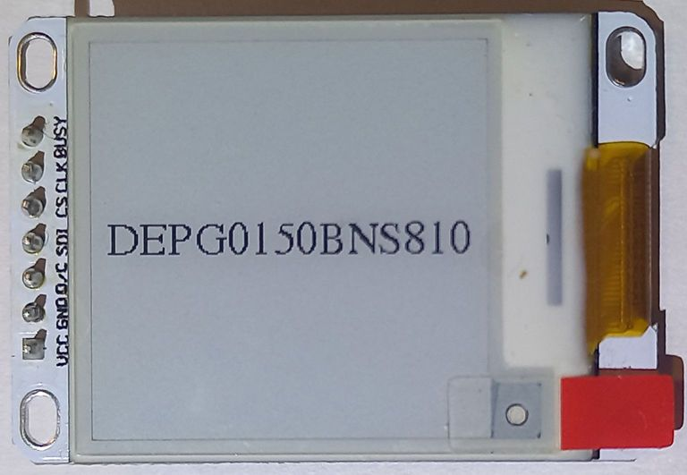</td>
            <td align="center">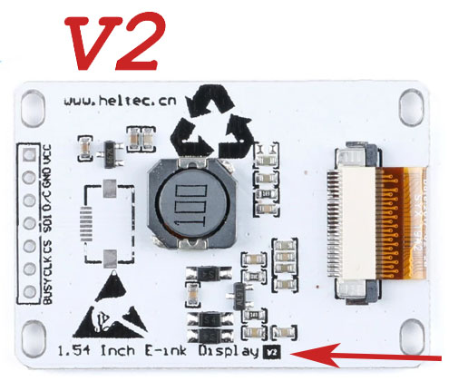</td>
            <td>1.54&nbsp;Inch&nbsp;E&#8209;ink&nbsp;Display&nbsp;V2</td>
            <td>Black, White</td>
            <td>Red Tab</td>
            <td>FPC-8101</td>
            <td>200 x 200</td>
            <td>Yes</td>
        </tr>
        <tr>
            <td><strong>DEPG0154BNS800</strong></td>
            <td align="center"></td>
            <td align="center">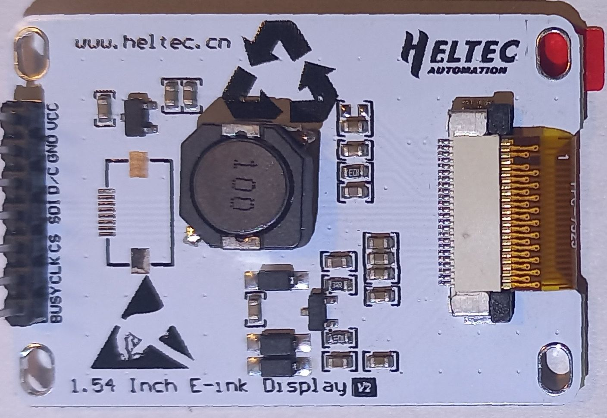</td>            
            <td>1.54&nbsp;Inch&nbsp;E&#8209;ink&nbsp;Display&nbsp;V2</td>
            <td>Black, White</td>
            <td>Red Tab</td>
            <td>FPC-7525</td>
            <td>152 x 152</td>
            <td>Yes</td>
        </tr>
        <tr>
            <td><strong>GDEP015OC1</strong>&nbsp;<sup>1</sup></td>
            <td align="center">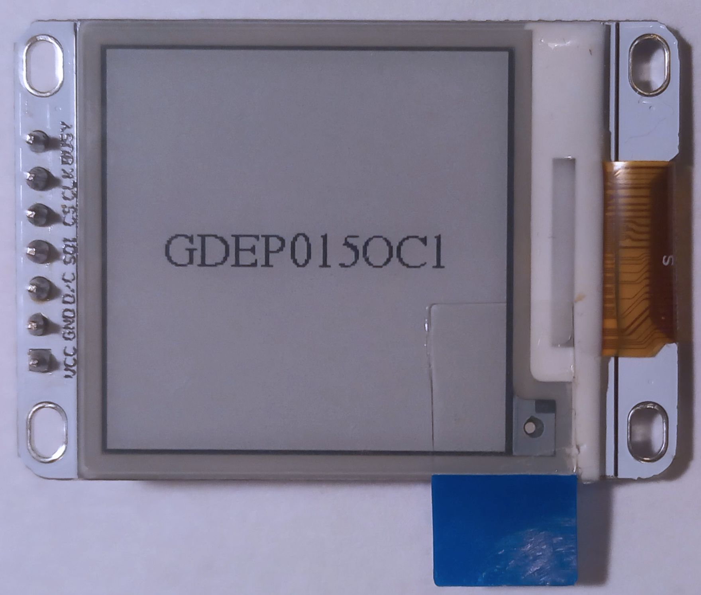</td>
            <td align="center">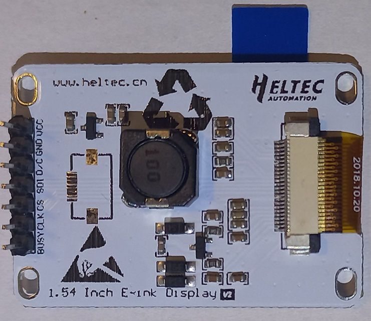</td>            
            <td>1.54&nbsp;Inch&nbsp;E&#8209;ink&nbsp;Display&nbsp;V2</td>
            <td>Black, White</td>
            <td>Blue Tab</td>
            <td>HINK-E0154A05-A2</td>
            <td>200 x 200</td>
            <td>Yes</td>
        </tr>
        <tr>
            <td><strong>DEPG0213RWS800</strong>&nbsp;<sup>2</sup></td>
            <td align="center">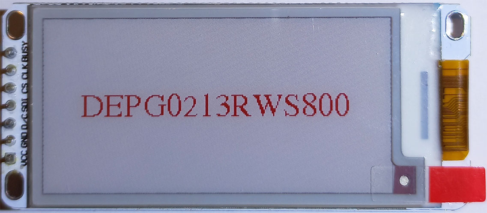</td>
            <td align="center">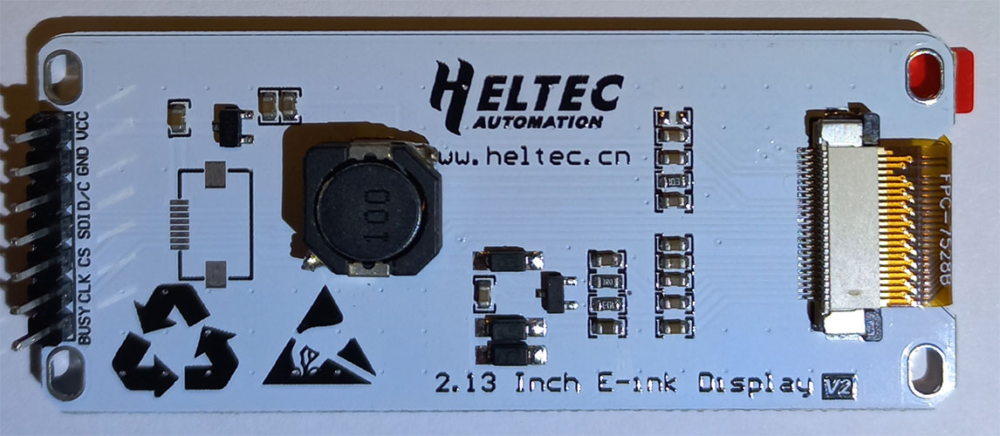</td>            
            <td>2.13&nbsp;Inch&nbsp;E&#8209;ink&nbsp;Display&nbsp;V2</td>
            <td>Black, White, Red</td>
            <td>Red Tab</td>
            <td>FPC-7528B</td>
            <td>250 x 122</td>
            <td>No</td>
        </tr>        
        <tr>
            <td><strong>QYEG0213RWS800</strong>&nbsp;<sup>2</sup></td>
            <td align="center">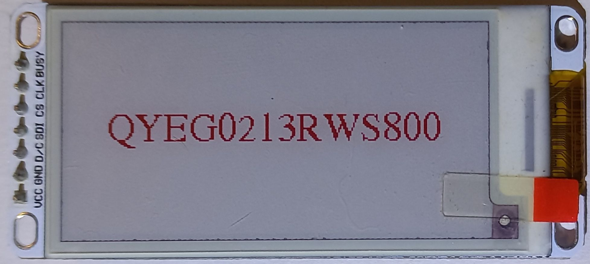</td>
            <td align="center">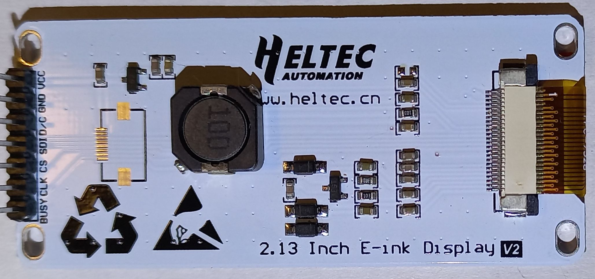</td>            
            <td>2.13&nbsp;Inch&nbsp;E&#8209;ink&nbsp;Display&nbsp;V2</td>
            <td>Black, White, Red</td>
            <td>Red Tab</td>
            <td>FPC-7528</td>
            <td>250 x 122</td>
            <td>No</td>
        </tr>
        <tr>
            <td><strong>DEPG0290BNS75A</strong>&nbsp;</td>
            <td align="center">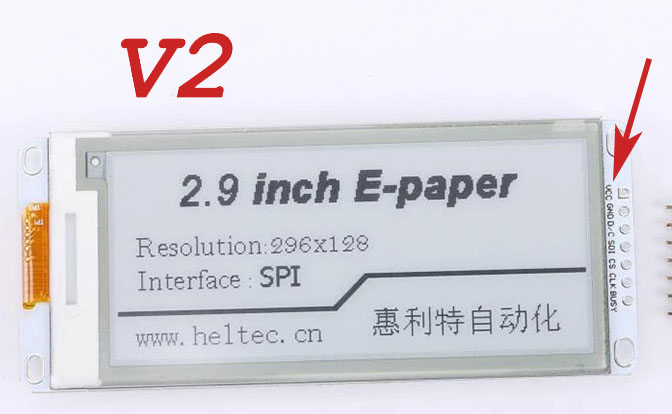</td>
            <td align="center">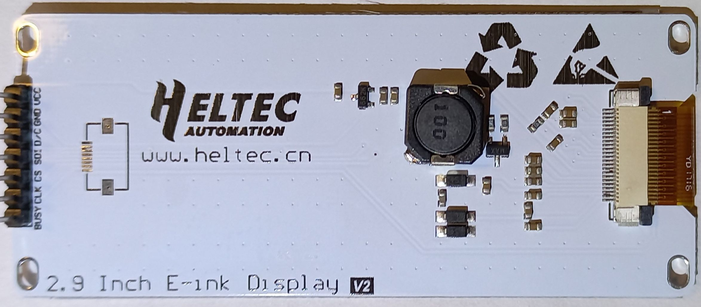</td>            
            <td>2.9&nbsp;Inch&nbsp;E&#8209;ink&nbsp;Display&nbsp;V2</td>
            <td>Black, White</td>
            <td>Red Tab</td>
            <td>FPC-750</td>
            <td>296 x 128</td>
            <td>Yes</td>
        </tr>
        <tr>
            <td><strong>DEPG0290BNS800</strong></td>
            <td align="center">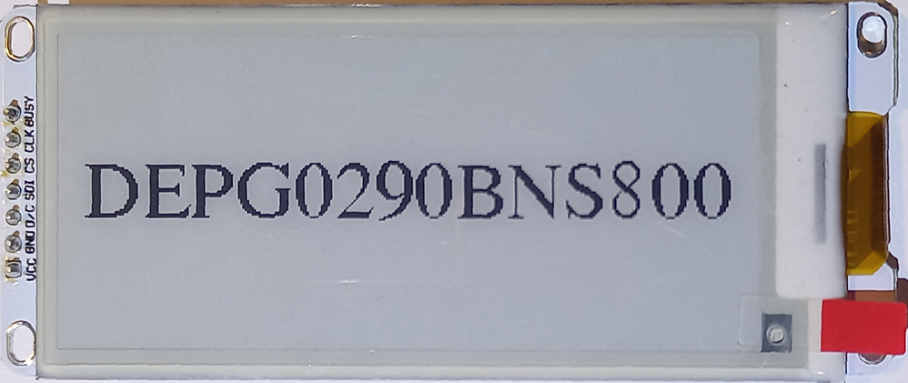</td>
            <td align="center">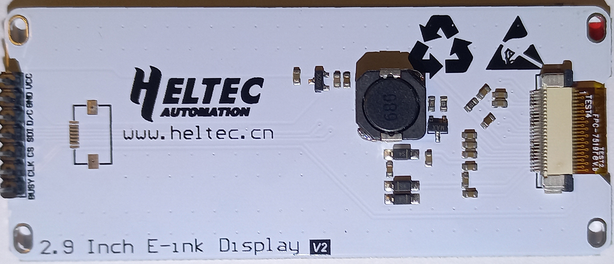</td>            
            <td>2.9&nbsp;Inch&nbsp;E&#8209;ink&nbsp;Display&nbsp;V2</td>
            <td>Black, White</td>
            <td>Red Tab</td>
            <td>FPC-7519 rev.b</td>
            <td>296 x 128</td>
            <td>Yes</td>
        </tr>
        <tr>
            <td><strong>GDE029A1</strong></td>
            <td align="center">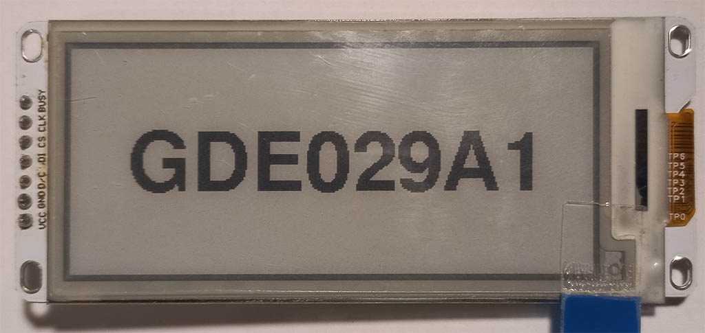</td>
            <td align="center"></td>
            <td>2.9&nbsp;Inch&nbsp;E&#8209;ink&nbsp;Display&nbsp;V2</td>
            <td>Black, White</td>
            <td>Blue Tab</td>
            <td>SYX-1553</td>
            <td>296 x 128</td>
            <td>Yes</td>
        </tr>
    </tbody>
</table>

<!-- End of table: Display Identification -->

<sup>1</sup> Closest match. No official information available. <br />
<sup>2</sup> Currently, these two displays use the same driver. This is not guaranteed in the future.


## Wiring

**Warning: in some cases, connectly directly to the display will cause damage!** <br />
See your boards's wiring page for specific information:

* [**Wiring:** Arduino Uno R3 / Arduino Nano](/docs/Wiring/wiring_m328p.md)
* [**Wiring:** Arduino Mega 2560](/docs/Wiring/wiring_m2560.md)
* [**Wiring:** ESP32](/docs/Wiring/wiring_esp32.md)
* [**Wiring:** ESP8266](/docs/Wiring/wiring_esp8266.md)

## To *page*, or not to *page*

Older boards, like Arduino UNO R3, do not have enough RAM to render a full screen image. A technique called "paging" lets us get around this issue.

On these older boards, your drawing comands are run, over and over, calculating just one small area at a time.

It takes a bit longer, but without paging, Arduino Uno R3 wouldn't stand a chance!


If you have a more powerful board (ESP, Mega), the library won't waste time paging. Your image will be calculated once, and once only.

If you board has the resources, paging is disabled automatically.
If, for any reason, you should want to turn it back on, you can set a `page_height` in your [constructor](/docs/API.md#display-constructors).

## Drawing stuff

```c++
#include "heltec-eink-modules.h"

// Use the correct class for your display; set pins for D/C, CS, BUSY
DEPG0150BNS810 display(2, 4, 5);

void setup() {

    // Drawing commands go in the DRAW loop
    DRAW (display) {
        display.fillCircle(50, 100, 20, BLACK);
        display.fillCircle(50, 100, 10, WHITE);
    }

}

void loop() {}
```

A block of `DRAW()` code represents one drawing session.
`DRAW()` starts as a blank piece of paper, renders your commands, then updates the display.

To draw over your existing image, see [setWindow()](/docs/API.md#setwindow)

If your board is powerful enough to disable paging, you have an alternative: <br />
Run drawing commands anywhere you like, then call [overwrite()](/docs/API.md#overwrite)

### Drawing Commands

You'll find a full list of supported commands in **[the API](/docs/API.md)**. Check out the [examples folder](/examples/) to see them in action.


Alternatively, [the official adafruit-gfx tutorial](https://learn.adafruit.com/adafruit-gfx-graphics-library/graphics-primitives) is a good place to start.

### Pre-rendered graphics

As decided by the Adafruit library, the ancient *"XBitmap"* is the format of choice for pre-rendered graphics. Luckily, GIMP maintains good support for it. If you need a hint on how to use it, I have thrown together a [tutorial on preparing XBitmap images](XBitmapTutorial/README.md).


## Configuration Options

### Pins

```c++
// Make sure to use the correct class for your display model
DEPG0150BNS810 display(dc, cs, busy);   
```

Pass the pin numbers to which the *D/C*, *CS*, and *BUSY* pins from the display are connected.

If you're using ESP32, you are free to set your *SDI*, and *CLK* pins too.

```cpp
DEPG0150BNS810 display(dc, cs, busy, sdi, clk);
```

### Page Size

If your Arduino is paging to compensate for low RAM, you may want to adjust how many rows are calculated in each page. The optional ```page_height``` argument sets the number of rows. 

For Uno R3, the default value is 20, meaning the display is calculated 20 rows at a time. Higher values use more RAM.

If you are using a more modern board, paging is disabled by default. Setting `page_height` here will re-enable it.

```c++
DEPG0150BNS810 display(dc, cs, busy, page_height); 
```

### Power Switching ###

Many E-ink manufacturers provide a deep-sleep mode. With Heltec displays, this mode is not usable.

As an alternative, consider using a transistor, or other switching device, to disconnect your display when needed.

The library can make the necessary pin changes for this.
Configure your switching device with [`usePowerSwitching()`](/docs/API.md#usepowerswitching), then call [`externalPowerOff()`](/docs/API.md#externalpoweroff) and [`externalPowerOn()`](/docs/API.md#externalpoweron) as required.

See your board's [wiring page](#wiring) for a suggested schematic.


### Fast mode (Partial Refresh)

E-Ink displays generally take several seconds to refresh. Some displays have a secondary mode, where the image updates much faster. This is known officially as a *"Partial Refresh"*. For the sake of simplicity, this library instead uses the term *"Fast Mode*".

The trade-off is that images drawn in fast mode are of a lower quality. The process may also be particularly difficult on the hardware. **Use sparingly.**

*Not all displays support fast mode.*

Call [`setFastmodeOn()`](/docs/API.md#fastmodeon) to enable.<br />
Call [`setFastmodeOff()`](/docs/API.md#fastmodeoff) to return to normal.

## Installation

**Arduino:** Library can be installed to Arduino IDE with *Sketch* -> *Include Library* -> *Add .Zip Library..*, or through the built-in Library Manager.

**Platform.io:** Available through the built-in library registry, or alternatively, can be installed by extracting the Zip file to the lib folder of your project.

## Acknowledgements

Display information from both [official Heltec sources](https://github.com/HelTecAutomation/e-ink), and  [GxEPD2](https://github.com/ZinggJM/GxEPD2)

Drawing functions provided by [GFX Root](https://github.com/ZinggJM/GFX_Root), which itself is a stripped down version of [Adafruit GFX](https://github.com/adafruit/Adafruit-GFX-Library).
