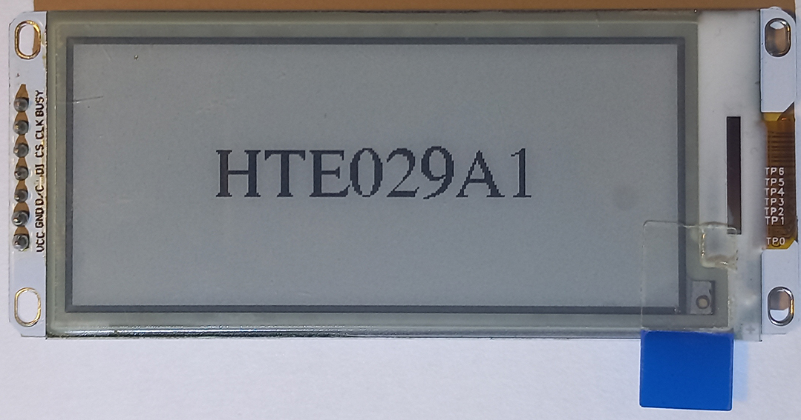
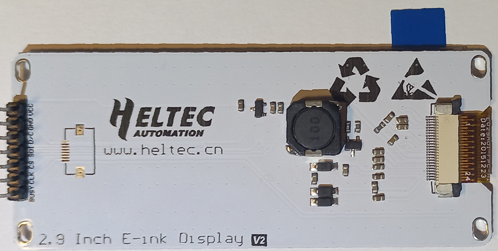
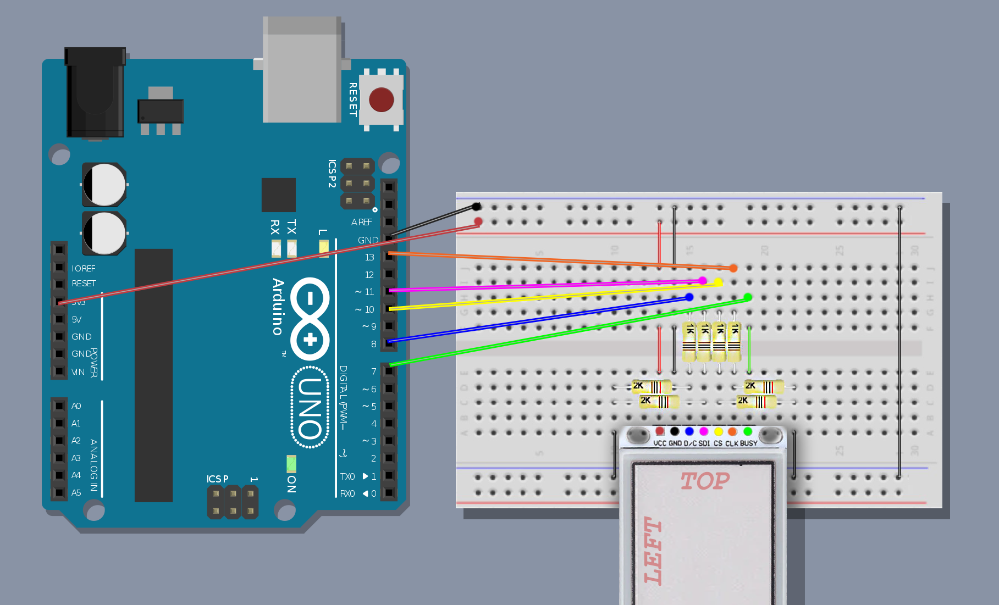
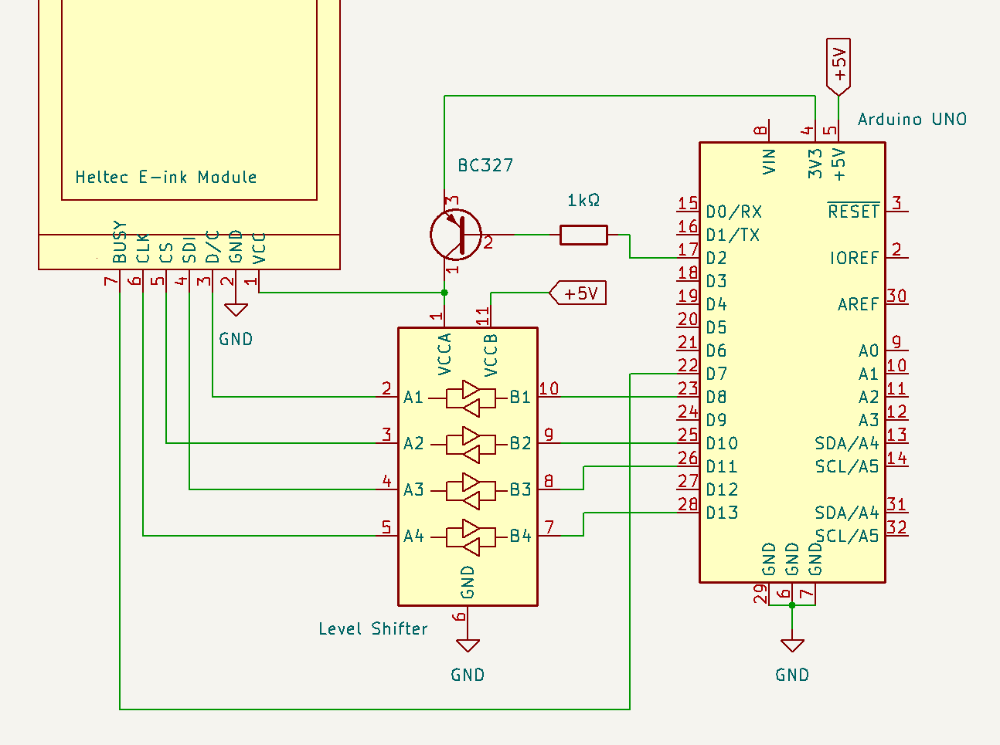

**Version 1.x users:** see [TRANSITIONING.MD](TRANSITIONING.md) for a list of breaking changes in Version 2
<br />

# Heltec E-Ink Modules

Third-party Arduino Library for **Heltec E-Ink Module** displays.
Supports run-time graphics and text generation using Adafruit-GFX (via [ZinggJM/GFX_Root](https://github.com/ZinggJM/GFX_Root))

This is made possible with *"paging".*

[Huh? Paging?](#what-is-paging) <br />
[Supported Displays](#supported-displays) <br />
[Wiring](#wiring) <br />
[Using the library](#using-the-library) <br />
[Configuration](#configuration-options) <br />
[Installation](#installation) <br />
[Acknowledgements](#acknowledgements)  <br />


## What is paging?

*In this context,* it means that the display is calculated and transmitted in several small pieces, rather than in one big memory-clogging lump. 

This means more calculations are performed, but less RAM is needed.
The resulting increase in calculation time ends up being insignificant, especially when compared to the slow refresh time of E-INK displays.

Most importantly, it is the what allows the *Arduino Uno* to work with these displays, which would otherwise overload the limited memory.


## Supported Displays

This list is likely to grow with time.

Heltec seem to release multiple, incompatible versions of the same display, which can appear superficially similar. In this library, displays are identified by the *model of the panel*. Unfortunately, the displays are not marked with this information. See [identification](#identifying-your-display)

Despite my best efforts I have been unable to source any of the older models, so if you have purchased your display in the last few years, it would seem likely that you have a V2 display.

|	Model Name  	        |	Sold As						|	Colors				|	Fastmode	    |	Resolution (px)
|---------------------------|-------------------------------|-----------------------|-------------------|--------------------------------
|	DEPG0150BNS810	        |	1.54 Inch E-ink Display V2	|	Black, White		|	Yes			    |	200 x 200
|	DEPG0154BNS800	        |	1.54 Inch E-ink Display V2	|	Black, White		|	Yes			    |	152 x 152
|	GDEP015OC1  <sup>1</sup>|	1.54 Inch E-ink Display V2	|	Black, White		|	Yes			    |	200 x 200
|	QYEG0213RWS800	        |	2.13 Inch E-ink Display V2	|	Black, White, Red	|	No			    |	250 x 122
|	DEPG0290BNS75A	        |	2.9 Inch E-ink Display V2	|	Black, White		|	No <sup>2</sup>	|	296 x 128
|   DEPG0290BNS800          |   2.9 Inch E-ink Display V2   |   Black, White        |   Yes             |   296 x 128
|   HTE029A1                |   2.9 Inch E-ink Display V2   |   Black, White        |   Yes             |   296 x 128

<sup>1</sup> Closest match. No official information available. <br />
<sup>2</sup> Heltec claim fastmode is supported, however the code they provide appears incorrect. The panel is not pre-programmed with the neccesary settings. Relevant settings do not appear to be available online. Further investigation required.

## Identifying your display
It can be a challenge determining exactly which display you have. This key is not definitive, but lists identifying details I have noticed so far.

|	Model Name  		                |	Rear Label									                |	Colors				|	Screen Protector	|Flex Connector Label   |	Front	|	Rear
|---------------------------------------|---------------------------------------------------------------|-----------------------|-----------------------|-----------------------|:-------------------------------------------------:|:---:
|	**DEPG0150BNS810**                  |	1.54&nbsp;Inch&nbsp;E&#8209;ink&nbsp;Display&nbsp;V2		|	Black, White		|	Red Tab				|	FPC-8101            |		|	
|	**DEPG0154BNS800**                  |	1.54&nbsp;Inch&nbsp;E&#8209;ink&nbsp;Display&nbsp;V2		|	Black, White		|	Red Tab             |   FPC-7525            |		|	
|	**GDEP015OC1**&nbsp;<sup>1</sup>    |	1.54&nbsp;Inch&nbsp;E&#8209;ink&nbsp;Display&nbsp;V2		|	Black, White		|	Blue Tab			|	HINK-E0154A05-A2    |			|	
|	**QYEG0213RWS800**	                |	2.13&nbsp;Inch&nbsp;E&#8209;ink&nbsp;Display&nbsp;V2		|	Black, White, Red	|	Red Tab				|	FPC-7528			|		|	
|	**DEPG0290BNS75A**&nbsp;            |	2.9&nbsp;Inch&nbsp;E&#8209;ink&nbsp;Display&nbsp;V2		    |	Black, White		|	Red Tab				|	FPC-750				|		|	
|	**DEPG0290BNS800**                  |	2.9&nbsp;Inch&nbsp;E&#8209;ink&nbsp;Display&nbsp;V2		    |	Black, White		|	Red Tab				|	FPC-7519 rev.b		|		|	
|	**HTE029A1**	                    |	2.9&nbsp;Inch&nbsp;E&#8209;ink&nbsp;Display&nbsp;V2		    |	Black, White		|	Blue Tab			|	SYX-1553			|	         |	

<sup>1</sup> Closest match. No official information available<br>

## Wiring

### The display is 3.3V, do not connect it directly to an Arduino.

All warnings aside, connection isn't all that hard. Just be sure to implement some sort of level-shifter. I can can confirm that a simple voltage divider is perfectly adequate, for example: 



### Display Pins:

* **VCC**: 3.3V Power In
* **GND**: Ground
* **D/C**: Data / Command
    * Tells display whether incoming serial data is a command, or is image data.
        * Can connect to any available digital pin on Arduino
        * 3.3V Logic Input, needs level shifter

* **SDI**: Serial Data Input
    * SPI *MOSI* pin
    * On Arduino UNO, *must connect to pin 11*
    * 3.3V Logic Input, needs level shifter
* **CS**: Chip Select
    * SPI *SS* Pin
    * Can connect to any available digital pin on Arduino, however *pin 10* is traditional. 
    * 3.3V Logic Input, needs level shifter
* **CLK**: Clock
    * SPI *SCK* pin
    * On Arduino UNO, *must connect to pin 13*
    * 3.3V Logic Input, needs level shifter
* **BUSY**
    * Pin is LOW when screen is ready to accept commands
    * Can connect to any available digital pin on Arduino
    * 3.3V Logic Output, **level shifter not required** as 3.3V is a valid level for a HIGH signal on Arduino UNO

Make sure to specify the location of your *D/C, CS* and *BUSY* pins in the constructor.


## Using the library

```c++
#include "heltec-eink-modules.h"

// Use the correct class for your display
DEPG0150BNS810 display(/* DC PIN */  8, /* CS PIN */  10, /* BUSY PIN */ 7);

void setup() {
    // Get everything ready
    display.begin();
    
    // All drawing commands go intside this WHILE
    while ( display.calculating() ) {
        display.fillCircle(50, 100, 20, display.colors.RED);
    }
    
    // Draw this new image to the display
    display.update();
}

void loop() {}
```

To summarise: 

* Set your hardware pins in the constructor
* Call ```.begin()```
* All drawing commands go inside the ```while ( .calculating () )``` loop. <br />
    This loop repeats the commands for each little slice (page) of the screen, as many times as needed
* Call ```.update()``` to show this new image data on the screen

That's it! Everything else (should) be taken care of automatically.

### Drawing Commands

In the interest of laziness, I'm going to direct you to [the official adafruit-gfx tutorial](https://learn.adafruit.com/adafruit-gfx-graphics-library/graphics-primitives) for information on the drawing commands. 

This library *should* work pretty much the same, with a few small exceptions:

* The display will only support a limited set of colors:
    * ```.colors.BLACK```
    * ```.colors.WHITE```
    * ```.colors.RED```  (3-Color displays only*)

* The adafruit ```.fillScreen()``` method will work just fine, however it is more efficient to use ```.setDefaultColor()```, before the paging while loop.

* A few new handy methods have been added to help with layout:
    * `.bounds.full.`	---   *Dimensions for the whole screen* <br />
                                         * `.left()` <br />
                            * `.right()` <br />
                            * `.top()` <br />
                            * `.bottom()` <br />
                            * `.centerX()` <br />
                            * `.centerY()` <br />
                            <br />
    * `bounds.window.`	---   *Dimensions for the current window ([see here](#setting-a-window))* <br />
                                         * `.left()` <br />
                            * `.right()` <br />
                            * `.top()` <br />
                            * `.bottom()` <br />
                            * `.centerX()` <br />
                            * `.centerY()` <br />
                            <br />
    * `.setCursorTopLeft()`  --- *sets text-cursor position by upper-left corner value*
    * `.getTextWidth()` 
    * `.getTextHeight()` 

As decided by the Adafruit library, the ancient *"XBitmap"* is the format of choice for pre-rendered graphics. Luckily, GIMP maintains good support for it.

If you need a hint on how to use it, I have thrown together a [tutorial on preparing XBitmap images](XBitmapTutorial/README.md).


## Configuration Options

* [Pins](#pins)
* [Page Size](#page-size)
* [Power Management](#power-management)
* [Setting A Window](#setting-a-window)
* [Fast Mode (Partial Refresh)](#fast-mode-partial-refresh)
* [Code Readability](#code-readability)

### Pins

```c++
// Make sure to use the correct class for your display model
DEPG0150BNS810 display(dc, cs, busy);	
```

Pass the Arduino digital pin numbers where the *D/C*, *CS*, and *BUSY* pins from the display are connected.

### Page Size

It is possible to change the *speed vs. memory* tradeoff while calling `.begin()`.

```c++
display.begin(display.pageSize.TINY); 	// 100kb of SRAM, 5% of total (Arduino UNO)
display.begin(display.pageSize.SMALL); 	// 250kb of SRAM, 12.5% of total (Arduino UNO)
display.begin(display.pageSize.MEDIUM); // 500kb of SRAM, 25% of total (Arduino UNO)
display.begin(display.pageSize.LARGE); 	// 1000kb of SRAM, 50% of total (Arduino UNO)
```

If `begin()` is called with no parameters, `.pageSize.MEDIUM` is selected.


### Power Management ###

Many E-Ink displays are able to enter a "deep sleep" power-saving mode. In this state, the module is no longer listening to any commands we issue. Traditionally, a hardware reset pin is provided, however, with the *Heltec Modules*, this is not the case.

One work-around is to manually cycle power to the display ("turn it off and on again"). This does require aditional circuitry.

A suitable method of controlling the power is shown here, using a PNP transistor and a FET based level-shifter:




```c++
void reset() {
    digitalWrite(2, HIGH);		// PNP transistor, block current flow
    delay(500);					// Wait for everything to power off
    digitalWrite(2, LOW);		// PNP transistor, allow current flow
    delay(500);					// Wait for everything to power back up
}

void setup() {
    // Set the pins for the reset
    pinMode(2, OUTPUT);
    digitalWrite(2, LOW);	// PNP transistor, allow current flow

    display.begin();
    while (display.calculating()) {
        display.print("hello world");
    }
    display.update();

    // Sleep, wait 8 seconds, and reset (wake up)
    display.deepSleep();	// Display ignores all commands now, until reset
    delay(8000);
    reset();

}
```


Note the use of ```.deepSleep()``` . This is the method which puts the display into power-saving. In this state, the current draw is very low, but the working memory is preserved. This is important, if you wish to wake the display and continue drawing from where you left off.

#### Do:

* **Feel free to avoid this whole section** <br />
If you don't ```deepSleep()```, you won't need a reset circuit.

* **Write your own ```reset()``` function** <br />
    It is not provided, as it must suit your individual circuit.

#### Don't:
* **Don't ```deepSleep()``` during fast-mode** <br />
    When you reset, your screen's contents won't be preserved

* **Don't use a [voltage dividing level shifter](#wiring)** <br />
    Enough current can pass through the signal lines to prevent the display from powering down. If this issue occurs, you can try ```digitalWrite()``` the pins in your ```reset()``` function.

* **Don't sleep by leaving display power disconnected** <br />
    *( Unless you really want to )* <br />
    The drawback is that the working memory will be lost. This is not an issue if, after power-on, you intend to ```clear()```, or redraw the entire screen.<br />
    If, instead, you go straight to *fastmode*, or ```setWindow()```, the display will show static. <br />
    If you do decide to sleep in this way, it is still a good idea to call ```.deepSleep()``` first. In some displays, it seems necessary to ensure that the image remains crisp.
    
<br />

### Setting a Window ###

By default, the entire screen contents will be erased and updated when ```while ( .calculating () ) ``` runs. Alternatively, it is possible to overwrite only a section of the screen, leaving the remainder unchanged. This section is referred to as a *window*.

```c++
display.setWindow( LEFT, TOP, WIDTH, HEIGHT );

while( display.calculating() )
{
    // Graphics commands go here e.g
    // display.drawRect(0, 0, 100, 100, display.colors.BLACK);
}
display.update();
```
If needed, make sure to call ```.setRotation()``` before ```.setWindow()```, as the library needs this information to properly place the window.

Be aware that, due to hardware limitations of the displays, windows may only be drawn with a width which is a multiple of 8. *(Note: this limitation does not rotate with the `.setRotation()` command)*.

It is possible to place a window so that it will have precisely the requested dimensions, however this is not strictly required as the library will automatically expand the window until it both satisfies the hardware limitations, and is large enough to encompass the requested region.

This automatic expansion can lead to a border around your graphics. One way to work around this issue is to use the dimensions calculated in `.bounds.window.*` (see [drawing](#drawing-commands)). 

```c++
display.drawRect( display.bounds.window.left(),
                  display.bounds.window.top(), 
                  display.bounds.window.width(),
                  display.bounds.window.height(), 
                  display.colors.BLACK );
```

*(That's a lot of typing for a value that you use so often..  - [yes, yes it is](#code-readability))*

These values are updated to reflect the true dimensions of the window, rather than the dimensions requested in `.calculating()`. This means that although your window won't be quite the size you asked for, you will at least be able to use its full width.

**Note that `.setRotation()` calls should go before `.setWindow()` calls.**

### Fast Mode (Partial Refresh)

E-Ink displays generally take several seconds to refresh. Some displays have a secondary mode, where the image updates much faster. This is known officially as a *"Partial Refresh"*. For the sake of user-friendliness, this library instead uses the descriptive term *"Fast Mode*".

The trade-off is that images drawn in fast mode are of a lower quality. The process may also be particularly difficult on the hardware. **You should make sure to exit fast mode when not in use.**

Not all displays support fast mode. Some displays may have a physical limitation, however with others, it seems that the technical settings have not yet been calculated and released.

To enter fast mode:
```c++
display.setFastmode( display.fastmode.ON );

while (display.calculating()) {
    // Graphics stuff here
}

// update() is called automatically in fast mode
```
Note that this state is somewhat tempermental. If you wish to call ```setWindow()```, or to return to ```fastmode.OFF```, you should use ```fastmode.FINALIZE```:
```c++
display.setFastmode( display.fastmode.FINALIZE );

while (display.calculating()) {
    // Graphics stuff here
}

// Also no need for update() here
```
Images drawn in ```fastmode.FINALIZE``` are preserved when moving window, or returning to ```fastmode.OFF```. <br />
Images drawn in ```fastmode.ON``` will not be preserved. 

When ```fastmode.FINALIZE``` has run, the display will automatically return to ```fastmode.OFF```.

### Code Readability ###

If you are like me, you might feel that all these long calls make your code "wordy":

```c++
display.drawRect( display.bounds.window.left(),
                  display.bounds.window.top(), 
                  display.bounds.window.width(),
                  display.bounds.window.height(), 
                  display.colors.BLACK );
```

As an alternative, declaring reusable "shortcuts" at the start of the code can really cut down on a lot of the bloat:

```c++
// Ugly mess here but
DEPG0150BNS810::Bounds::Window w = display.bounds.window;
DEPG0150BNS810::ColorList c = display.colors;
        
// Nice & clean here
display.drawRect( w.left(), w.top(), w.width(), w.height(), c.BLACK );
```


## Installation

**Arduino:** Library can be installed to Arduino IDE with *Sketch* -> *Include Library* -> *Add .Zip Library..*, or through the built-in Library Manager.

**Platform.io:** Available through the built-in library registiry, or alternatively, can be installed by extracting the Zip file to the lib folder of your project.

## Acknowledgements

This library is inspired by [GxEPD2](https://github.com/ZinggJM/GxEPD2), a similar project for Goodisplay and Waveshare displays.

Information on how to correctly communicate with the display hardware was provided by on the [official Heltec library](https://github.com/HelTecAutomation/e-ink).

The drawing functions are provided by [GFX Root](https://github.com/ZinggJM/GFX_Root), which itself is a stripped down version of [Adafruit GFX](https://github.com/adafruit/Adafruit-GFX-Library).
