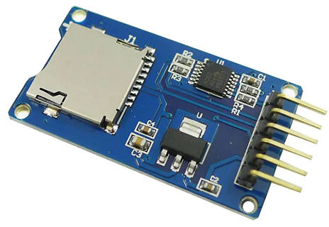
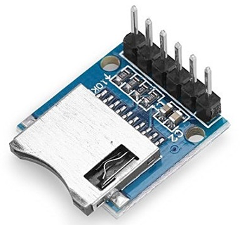
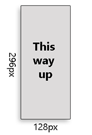
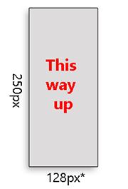

# Heltec E-ink Modules - SD Card

These methods allow reading and writing **.bmp images** from an SD / MicroSD card, using a cheap SPI adapter.

With level-shifter  |   Without level-shifter
--------------------|-------------------------
 | 

⚠ Depending on your adapter, and your Arduino, additional level-shifting circuitry may be required.

For more information, see: [wiring](/docs/README.md#wiring).

- [Limitations](#limitations)
- [Canvases](#canvases)
  - [Loading a canvas](#loading-a-canvas)
  - [Writing a canvas](#writing-a-canvas)
- [Drawing with .bmp files](#drawing-with-bmp-files)
- [Getting Info](#getting-info)


## Limitations

* Low speed
    * "draw bitmap file" methods : worse with paging - Uno, Mega <sup>*some displays</sup> 
    * "writing" methods: worse with ESP32 - Bugs in espressif/arduino-esp32 SD library <sup>\*as of *2023/10/1*</sup>
* Bigger sketches
    * On Arduino Uno, >60% Flash used
    * Other platforms - less of an issue 
* Higher RAM usage
    * Depending on your code, may need to lower `page_height` in constructor.
* Not all methods available for UNO
    * `draw24BitBitmapFile()` consumes too much RAM
* Card format must be FAT or FAT32

## Canvases

*Canvas* refers to a specific type of .bmp image.
* 24bit .bmp file
* Portrait, not landscape
* Dimensions: full screen width x height

Example: DEPG0290BNS75A | Example: QYEG0213RWS800
---|---
 | 

\* For displays QYEG0213RWS800 / DEPG0213RWS800, a hardware quirk gives a canvas width of 128px, rather than the advertised 122px

### Loading a canvas

`loadCanvas()` is the most efficient of the SD card methods.

```cpp
DEPG0290BNS75A display(2, 4, 5);

void setup() {
    // Once, set CS pin
    display.useSD(7);

    display.loadCanvas("test_canvas.bmp");
}
```
Alternatively, `loadCanvas()` accepts an integer <1000.<br />
`loadCanvas(001)` will load file `canvas001.bmp` from SD root.

### Writing a canvas
Instead of drawing to display, the output can be directed into a canvas.

```cpp
DEPG0290BNS75A display(2, 4, 5);

void setup() {
    // Once, set CS pin
    display.useSD(7);

    SAVE_CANVAS (display, "test_canvas.bmp") {
        display.setCursor(20, 20);
        display.print("Hello, World!");
    }

}
```

If your microcontroller is powerful enough, you can skip the `SAVE_CANVAS` loop (similar to `update()`)

```cpp
DEPG0290BNS75A display(2, 4, 5);

void setup() {
    // Once, set CS pin
    display.useSD(7);

    display.setCursor(20, 20);
    display.print("Hello, World!");

    display.saveCanvas("test_canvas.bmp");
}
```

`SAVE_CANVAS()` and `saveCanvas()` also accept integers, the same as `loadCanvas()` (above)

## Drawing with .bmp files
The most efficient option is to use "monochromatic bitmaps" (1-bit). These can be processed much like [XBitmaps](/docs/XBitmapTutorial/mono.md).

Much like XBitmaps, these are drawn as part of the normal drawing flow.

```cpp
DEPG0290BNS75A display(2, 4, 5);

void setup() {
    // Once, set CS pin
    display.useSD(7);

    DRAW (display) {
        display.drawMonoBitmapFile(0, 0, "mono.bmp", BLACK);
    }    
}
```

Another option is to draw "24bit bitmaps" (color).
This is much less efficient, but could be convenient when working with 3-Color displays.

```cpp
DEPG0290BNS75A display(2, 4, 5);

void setup() {
    // Once, set CS pin
    display.useSD(7);

    DRAW (display) {
        display.draw24bitBitmapFile(0, 0, "24bit.bmp");
    }    
}
```

## Getting Info

```cpp
DEPG0290BNS75A display(2, 4, 5);

void setup() {
    // Set CS pin
    display.useSD(7);

    // Check card connection
    if ( !display.SDCardFound() )
        return;

    // Check file
    if ( !display.SDFileExists("test.bmp" ))
        return;

    // Check if canvas is valid
    if ( !display.SDCanvasValid("test.bmp")) {
        // Do something?
    }


    // Check if canvas is valid, and delete if corrupt
    if ( display.SDCanvasValid("test.bmp", true) ) {
        // Do something?
    }

    int width = display.getBMPWidth("test.bmp");
    int height = display.getBMPHeight("test.bmp");
}
```
