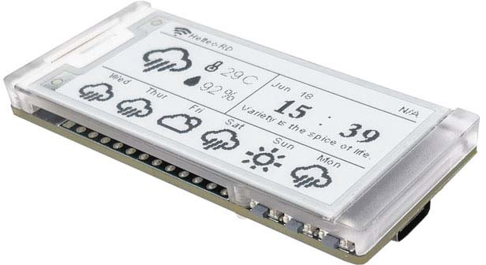
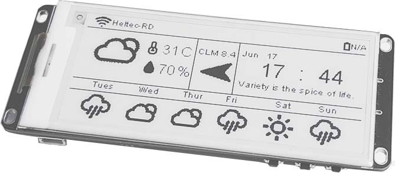
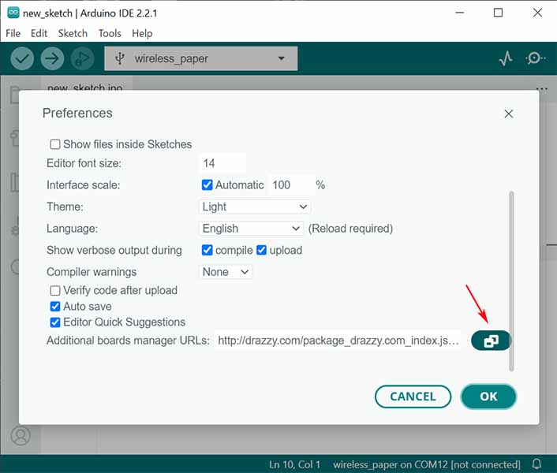
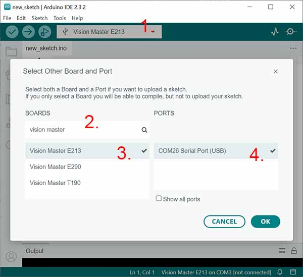

# Heltec E-Ink Modules - Vision Master




In addition to the line of SPI E-Ink displays, Heltec sell a line of all-in-one "Vision Master" boards. 

Two of these use E-Ink displays:
* Vision Master E213
* Vision Master E290

#### Features:
  * ESP32-S3 Microcontroller
  * 2.13" or 2.9" Black and White E-Ink display
  * WiFi, Bluetooth connectivity. LoRa optional.

Only the board's E-Ink display falls within the scope of this library.

- [Getting Started](#getting-started)
  - [Arduino IDE](#arduino-ide)
  - [PlatformIO](#platformio)
- [Using the library](#using-the-library)
- [Things to know](#things-to-know)
  - [`VExtOn()`](#vexton)


## Getting Started

### Arduino IDE

1. Open preferences 

    

2. Open "Additional board manager URLs"

    

3. Add the URL: `https://github.com/Heltec-Aaron-Lee/WiFi_Kit_series/releases/latest/download/package_heltec_esp32_index.json`

    

4. Open the Board Manager, search for Heltec, and install the latest version of `Heltec ESP32 Series Dev-boards`. <br />
This may take some time.

    

1. With your device connected, open the board selection drop-dowm, search for "vision master", then select your model and serial port.

    

### PlatformIO
(Alternative to Arduino IDE)

Add the following entries to your `platformio.ini` file

```
[env:vision-master-e213]
platform = espressif32
board = heltec_wifi_lora_32_V3
framework = arduino
monitor_speed = 115200
monitor_filters = esp32_exception_decoder
board_upload.use_1200bps_touch = true
build_flags = 
  -D ARDUINO_USB_CDC_ON_BOOT=1
  -D Vision_Master_E213

[env:vision-master-e290]
platform = espressif32
board = heltec_wifi_lora_32_V3
framework = arduino
monitor_speed = 115200
monitor_filters = esp32_exception_decoder
board_upload.use_1200bps_touch = true
build_flags = 
  -D ARDUINO_USB_CDC_ON_BOOT=1
  -D Vision_Master_E290
```

## Using the library

Check out the examples, such as *File > Examples > heltec-eink-modules > VisionMaster > basic*

Make sure to select your display model first, at the top of the sketch.

The upload process will be slow when compiling for the first time. Saving your sketch allows the IDE to re-use much of the old code, without recompiling.

**Here's a rough idea:**
```cpp
#include <heltec-eink-modules.h>

// Pick your display model:

// EInkDisplay_VisionMasterE213 display;
// EInkDisplay_VisionMasterE290 display;

void setup() {
    display.landscape();

    display.print("Hello, World!");
    display.update();

    delay(2000);
    
    display.clearMemory();
    display.printCenter("Centered Text");
    display.update();

    delay(2000);

    display.clear();
}

void loop() {

}
```

## Things to know

### `VExtOn()`
The display has an ACTIVE HIGH power switch on GPIO18. For Vision Master E213, this also enables power to the I2C connector.
The *heltec-eink-modules* libary will switch this on when first required.

If needed, you can manually power on the hardware with `Platform::VExtOn()`.
