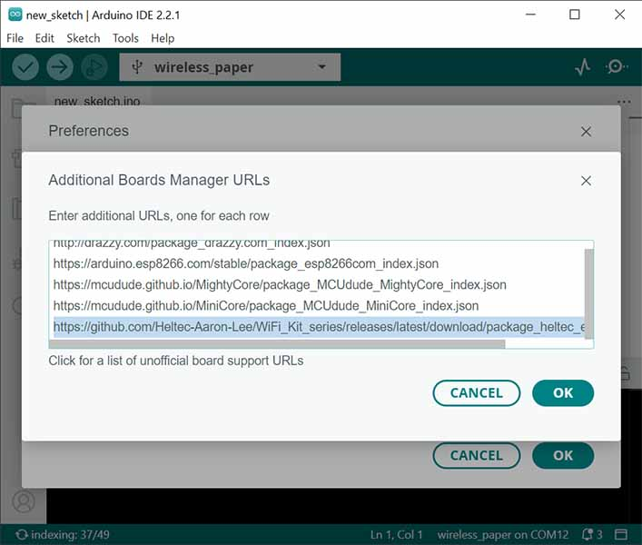
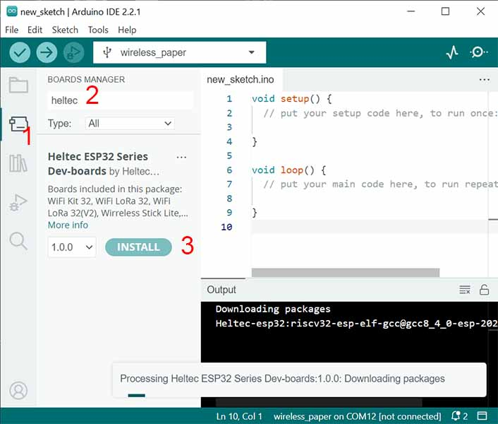
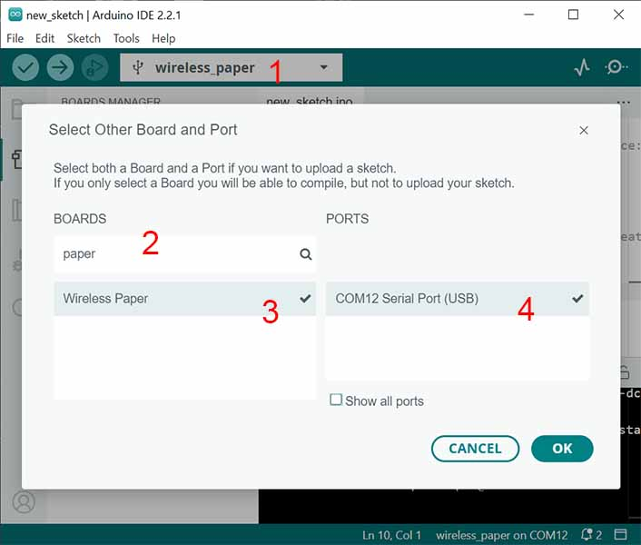

# Heltec E-Ink Modules - Wireless Paper


In addition to the line of SPI E-Ink displays, Heltec sell an all-in-one board, "Wireless Paper".

#### Features:
  * ESP32 Microcontroller
  * 2.13" Black and White E-Ink display
  * WiFi, Bluetooth & LoRa connectivity

Only the board's E-Ink display falls within the scope of this library.

## Getting Started

### Arduino IDE

1. Open preferences 

    

2. Open "Additional board manager URLs"

    

3. Add the URL: `https://github.com/Heltec-Aaron-Lee/WiFi_Kit_series/releases/latest/download/package_heltec_esp32_index.json`

    

4. Open the Board Manager, search for Heltec, and install the latest version of `Heltec ESP32 Series Dev-boards`. <br />
This may take some time.

    

5. With your "Wireless Paper" connected, open the board selection drop-dowm, search for "paper", then select Wireless Paper, and your board's serial port.

    

You should now be able to upload the the "wireless_paper" example from *File > Examples > heltec-eink-modules > wireless_paper*. The process may be slow, when compiling for the first time.

Make sure to select your [display model](/docs/README.md#wireless-paper) first, at the top of the sketch.

Most of the other examples will also run on the Wireless Paper board, so long as you select the correct display model.

### PlatformIO

Add the following entry to your `platformio.ini` file

```
[env:wireless_paper]
platform = espressif32
board = heltec_wifi_lora_32_V3
framework = arduino
lib_deps = https://github.com/todd-herbert/heltec-eink-modules
```

## Things to know

### `VExtOn()`
The display, and wireless hardware, have an ACTIVE LOW power switch on GPIO45. 
The *heltec-eink-modules* libary will switch this on when first required.

If needed, you can manually power on the hardware with `Platform::VExtOn()`.

### Deep Sleep
In order to achieve the promised 18uA deep sleep current, a number of config steps must take place.

Calling `Platform::prepareToSleep()` will hopefully take care of this for you.

```cpp
// Configure hardware for low-power
Platform::prepareToSleep();

// How long until restart
esp_sleep_enable_timer_wakeup( SLEEP_TIME_IN_MICROSECONDS );

// Sleep now
esp_deep_sleep_start();
```

The 18uA current is only achievable when powering with the battery connector. When USB is connected, an orange LED remains on.
