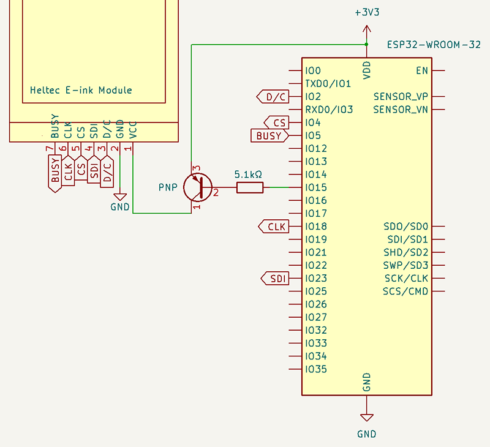

# Heltec E-ink Modules
## Wiring: ESP32

**✅ ESP32 uses 3.3V logic. It can connect directly to display.**

Display | ESP32
--------|--------
 VCC    | 3.3V
 GND    | GND
 D/C    | GPIO 2
 SDI    | GPIO 23 (VSPI MOSI)
 CS     | GPIO 4
 CLK    | GPIO 18 (VSPI SCK)
 BUSY   | GPIO 5

All pins can be changed, using an extended constructor:
```cpp
DISPLAY_CLASS(DC_PIN, CS_PIN, BUSY_PIN, SDI_PIN, CLK_PIN); 
```

### (Optional) Suggested additional wiring, for power saving

```cpp
void setup() {
    // GPIO 15, PNP transistor
    display.usePowerSwitching(15, PNP);

    //Later, when required:
    display.externalPowerOff();
    display.externalPowerOn();
}
```

