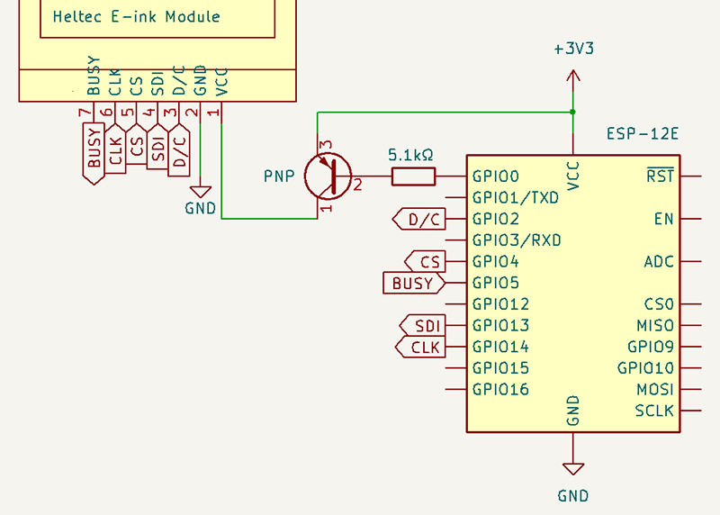

# Heltec E-ink Modules
## Wiring: ESP8266

**✅ ESP8266 uses 3.3V logic. It can connect directly to display.**

Note: labels are for the "GPIO" pins, not the "D1, D2, etc." labels printed on the board.


Display | ESP8266
--------|--------
 VCC    | 3.3V
 GND    | GND
 D/C    | GPIO 2 *
 SDI    | GPIO 13
 CS     | GPIO 4 *
 CLK    | GPIO 14
 BUSY   | GPIO 5 *

\* Can be set in constructor. Take care to avoid "iffy" pins on the ESP8266.

### (Optional) Suggested additional wiring, for power saving

```cpp
void setup() {
    // GPIO 0, PNP transistor
    display.usePowerSwitching(0, PNP);

    //Later, when required:
    display.externalPowerOff();
    display.externalPowerOn();
}
```

