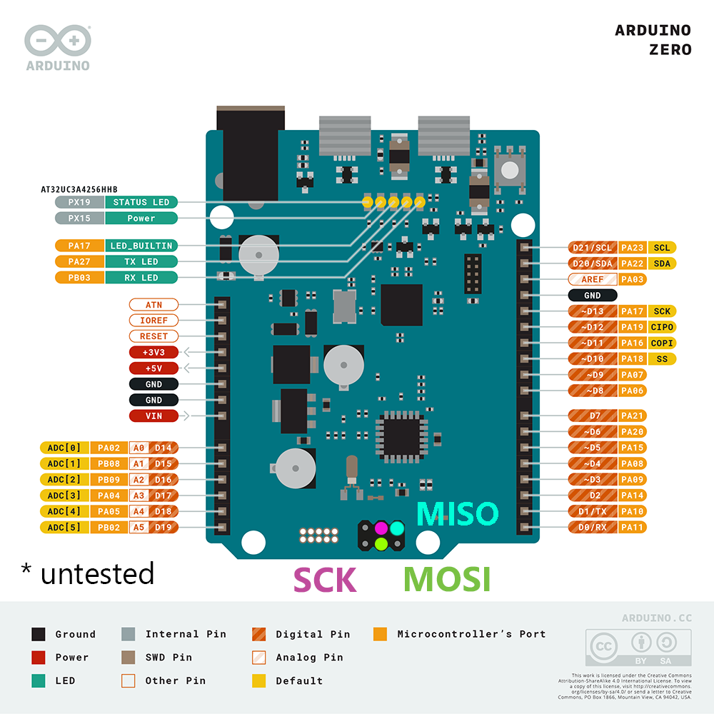
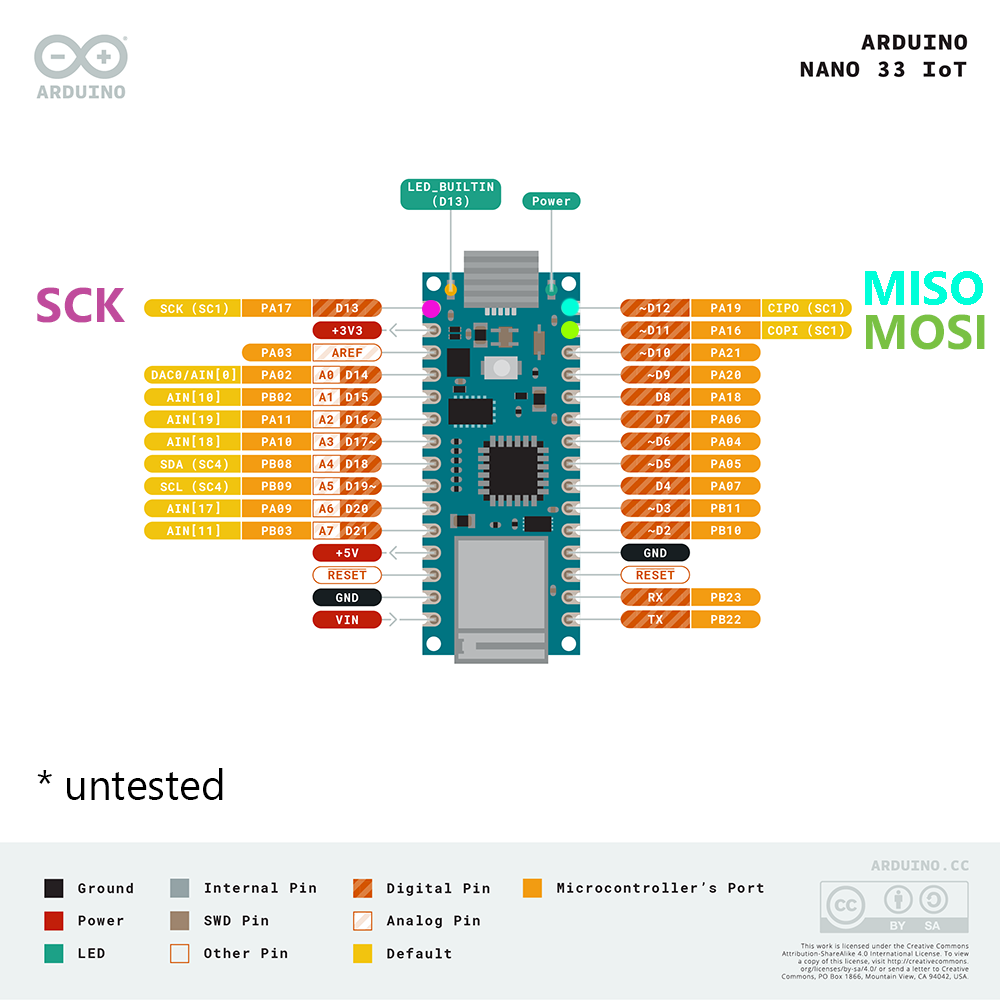
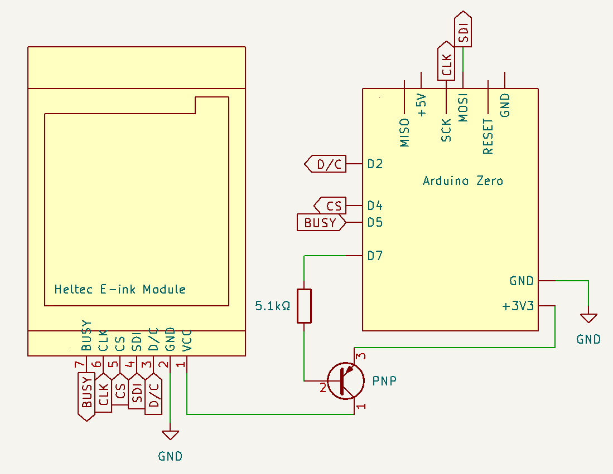

# Heltec E-ink Modules
## Wiring: SAMD21G18A

**✅ SAMD21G18A uses 3.3V logic. It can connect directly to the display.**

Display | SAMD21G18A
--------|--------
 VCC    | 3.3V
 GND    | GND
 D/C    | D2
 SDI    | MOSI (COPI)
 CS     | D4
 CLK    | SCK
 BUSY   | D5


### Where are *MOSI* and *SCK* (and *MISO*)?
*Good question.* The location depends on your board.

These suggested locations are untested: I do not own either board. Please let me know if they do not work.

Arduino Zero | Arduino Nano 33 IoT
-------------|--------------------
 | 

### (Optional) Changing MOSI and SCK pins

All pin assignments can be changed, using an extended constructor:
```cpp
DISPLAY_CLASS(DC_PIN, CS_PIN, BUSY_PIN, SDI_PIN, CLK_PIN); 
```

Due to hardware limitations, only certain alternate wiring pairs are valid for SDI and CLK:

SDI pin | SCK pin  
--------|---------
2       | 5        
2       | 5        
2       | SCK*     
4       | 3        
4       | 5        
5       | 3        
5       | A2       
10      | 12       
11      | 12       
11      | 13       
12      | 13       
A1      | 5        
A1      | A2       
A1      | SCK*     
MISO*   | 5       
MISO*   | A2      
MISO*   | SCK*    
MOSI*   | 5         
SCK*    | A2

<sub>\* ICSP Header</sub>

 If your selection is invalid, your board's `LED_BUILTIN` will blink out an "SOS".

### (Optional) Suggested additional wiring, for power saving

```cpp
void setup() {
    // GPIO 7, PNP transistor
    display.usePowerSwitching(7, PNP);

    //Later, when required:
    display.externalPowerOff();
    display.externalPowerOn();
}
```



### (Optional) Additional wiring: MicroSD card module
**✅ SAMD21 uses 3.3V logic. It can connect directly to microSD module.**
```cpp
void setup() {
    // Set MicroSD CS pin
    display.useSD(7);
}
```

 Micro SD Module    | SAMD21G18A
 -------------------|-------
 VCC                | 3.3V
 CS                 | D7
 MOSI               | MOSI
 SCK                | SCK
 MISO               | MISO
 GND                | GND

*MOSI* and *SCK* pins can be changed in the display constructor (see above).

*CS* pin (card) must be set with `useSD(cs)`. Any free pin may be used.

Optionally, MISO may also be set, with `useSD(cs, miso)`. <br />
Only certain combinations are possible, depending on which *SDI* and *SCK* pins you may have set in the constructor.

SDI pin     | SCK pin   | Possible MISO pins
------------|---------- |--------------------
(default)   | (default) | A1, A2, MISO*
2           | 5         | 3, 4
2           | 5         | A1, A2, MISO*
2           | SCK*      | A1, A2, MISO*
4           | 3         | 2, 5
4           | 5         | 2, 3
5           | 3         | 2, 4
5           | A2        | 2, A1, MISO*, MOSI*
10          | 12        | 11, 13
11          | 12        | 10, 13
11          | 13        | 10, 12
12          | 13        | 10, 11
A1          | 5         | 2, A2, MOSI*
A1          | A2        | 2, 5, MOSI*, SCK*
A1          | SCK*      | 2, A2, MOSI*
MISO*       | 5         | 2, A2, MOSI*
MISO*       | A2        | 2, 5, MOSI*, SCK*
MISO*       | SCK*      | 2, A2, MOSI*,
MOSI*       | 5         | A1, A2, MISO*
SCK*        | A2        | 2, A1, MISO*, MOSI*

<sub>\* ICSP header</sub>

If your selection is invalid, your board's `LED_BUILTIN` will blink out an "SOS".